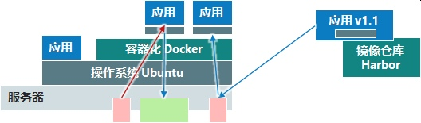
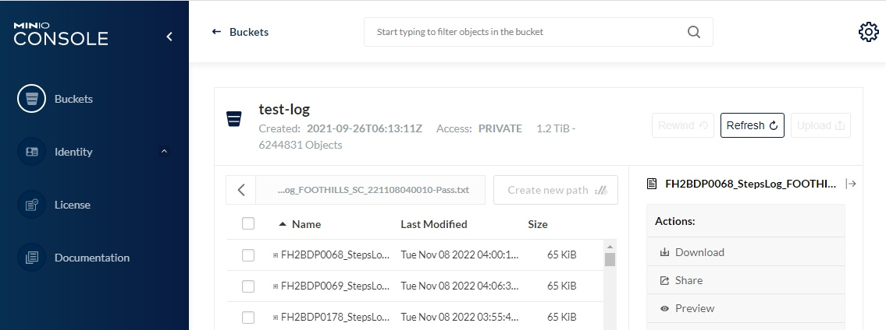

# Big Data Cloud Center Training BDCC 培训课程

 

## 课程题目：BDCC Infra 技术介绍

| 课程编号 | 分类         | 等级     | 版本 | 更新日期   |
| :------- | :----------- | :------- | :--- | :--------- |
| I100     | 平台基础设施 | 入门级别 | 1.0  | 2022-11-15 |

### 课程受众与目标

- **IT 运维人员**，了解 BDCC 方案用到的支撑类服务，容器化部署等方式。
- **大数据方案工程师**，理解大数据业务下会用到的服务。

### 课程在 BDCC 架构中的映射

[Toc]

# 课程内容

## 概览

BDCC 基础设施包含了基于一系列开源组件，及部分自有服务实现的大数据服务群。

- 我们选择了大数据领域，相对常用、成熟的服务作为大数据基础。
- 自有服务主要完成业务包装、聚合，使用户可以相对集中的访问、管理自己的业务数据。
- 这些服务在英业达内部有长期应用，所以还包含了这些服务的配置、管理、运维的最佳实践。
- 我们也会保持对这些组件的研究、更新，保证整个服务群的持续有效。

## 服务器与 Linux 系统

服务器硬件与系统是服务部署、运行的基础，提供了必要的性能保证。

### 服务器选型

服务器选型遵循下列思路：

- 双路服务器，有两个 CPU；CPU 倾向于多核心、低主频。
  - 因为大数据服务基本都是集群多点服务，并且一个主机上会运行众多服务实例；同样价格下，多核心的作用大一些。
  - 即便考虑到资源后续增加，CPU 也是一开始就配满 2 个。
- 内存，主流使用 512G 内存
  - 作为大数据早期，需要资源不多，主流 12 DIMM/CPU，可以以 4 的倍数，占 4 或 8 个，为以后扩展流出空间。
  - 32G x 8(DIMM) x 2(CPU) = 512G，扩展同样 32G 可以到 768G，扩展 64G 可以到 1T 内存。
- 网络，服务器默认带 4x1G 电口或 2x25/10G 光口网卡，按照目前企业主流交换机相匹配就行。
  - 但是对于大数据服务集群，有大量数据会在节点之间通信，10/25、甚至 40G 的光口网卡是有作用的。
  - 服务器主板的 PCIE 插槽，支持网卡扩展不成问题。
- 硬盘，通常选择前面 12 大盘位的 2U 服务器
  - 大数据服务，有多类数据存储服务，对磁盘 IO、空间都有要求，因此 SSD、HDD 都需要，并且多为单盘、不做 Raid 使用。
    - SSD 主要支持 DB、Redis、Etcd 等偏实时类服务存储
    - HDD 主要支持 Greenplum 历史数据、OSS 历史文件的存储。
    - 目前 2SSD+4HDD，还预留了一半槽位可以扩展。
  - 2U 机器，通常还有后面两个 SSD 2.5 寸盘位，做 Raid1 作为系统盘。

### Ubuntu LTS

大数据服务的开源服务都是基于 Linux 运行的，我们选择主流发行版来作为基础系统、运行环境，如下考虑：

- 良好社区支持，Ubuntu 大量用在生产环境。
- 稳定及时的补丁更新，重大漏洞补丁发布及时，长期支持版（LTS，Long-Term-Support）有 5 年的安全更新支持。
- 清晰稳定的版本发布，Ubuntu 每 2 年发布一版长期支持版；且支持版本间升级。我们目前使用的是 `Ubuntu 20.04.5 LTS`。
- 便于构建的内网升级源，大量、多网络服务器节点，都申请对外访问不方便、也有一些安全隐患；Ubuntu 的 APT 源便于在厂内建立，也能提高系统更新速度。

## 容器化服务部署

**容器化**是一种软件部署流程，是指将软件代码和所需的所有组件（例如库、框架和其他依赖项）打包在一起，让它们隔离在自己的"容器"中。容器内的软件或应用就可以在任何环境和任何基础架构上一致地移动和运行，不受该环境或基础架构的操作系统影响。

BDCC 所有服务都采用容器化部署，主要考虑如下好处：

- 隔离服务依赖与系统软件环境，不会在 Server Ubuntu 上安装任何业务服务依赖。
- 便于服务部署，版本的更新与回退。
- 便于服务数据备份，配置文件、持久化数据都放置在确定已知的目录下。

### Docker 容器化

Docker 是容器化最常见的服务实现，我们使用单机及 Swarm 模式来进行服务部署。长期来看，会迁移到基于 Kubernetes 的容器集群管理。

容器化对服务版本的管理，是服务容器镜像；在大型部署场景下，会建立独立的镜像源，比如使用 Harbor 服务。目前在群电，我们使用互联网代理源、或者通过 VPN 访问英业达内网源就够用。

> 相关课程：【I101 BDCC Infra Docker 技术应用介绍】

## 数据服务 BDCC

BDCC 直接依赖的数据类服务，是实现业务数据存储、交换、处理相关的服务。

- 存储：关系数据库，事务数据库 PostgreSQL，分布式分析数据库 Greenplum。
- 交换：消息队列 Kafka。
- 处理：定时执行批任务 Dkron+Kettle，流处理任务 Flink，CDC 任务 Kafka Connect。

### OLTP 事务数据库 PostgreSQL

PostgreSQL 是一款高级的企业级开源关系数据库，支持 SQL（关系型）和 JSON（非关系型）查询。它是一个高度稳定的数据库管理系统，依托 20 多年的社区发展，造就了其高水平的故障恢复能力、完整性和正确性。PostgreSQL 可用作很多 Web、移动、地理空间和分析应用程序的主要数据存储或数据仓库。PostgreSQL 是开源第二大数据库，其开源协议是纯免费的。

### OLAP 分析数据库 Greenplum

GreenPlum 数据库是基于 PostgreSQL 基础上开发，具有巨大的并行处理能力的数据仓库，MPP( massively parallel processing )是 Greenplum 的主要特性， MPP 是指服务器上拥有两个或者以上的处理节点，并且多个处理节点可以并行,协同的工作来完成一个计算， 这些处理节点拥有独自的内存,操作系统和硬盘, 处理节点可以理解成为一台物理主机。Greenplum 会分发 TB 及以上的数据到所有的子节点，并且当在 Greenplum 上执行查询时，所有的子节点能够利用各自的资源来并发地执行这个查询。

### 消息服务 Kafka，Connector

Kafka 是一个开源流处理平台，该项目的目标是为处理实时数据提供一个统一、高吞吐、低延迟的平台。其持久化层本质上是一个“按照分布式事务日志架构的大规模发布/订阅消息队列”，这使它作为企业级基础设施来处理流式数据非常有价值。

Kafka 是 BDCC 方案中实时处理的中心组件。

服务地址：

- Topic 管理服务，http://bdcc-logi.sz.chiconypower.com.cn
- Topic 消息查询，http://bdcc-kowl.sz.chiconypower.com.cn
- Kafka Rest Proxy Producer，http://bdcc-kafka-proxy-producer.sz.chiconypower.com.cn

> 相关课程：【I103 BDCC Infra Kafka 技术应用介绍】

### 实时数据任务 Flink

Flink 是一个框架和分布式处理引擎，用于在数据流上进行有状态的计算，并能以内存速度和任意规模进行计算。常见的数据流比如：信用卡交易、传感器测量、机器日志、网站或移动应用程序上的用户交互记录。Flink 旨在任意规模上运行有状态流式应用。因此，应用程序被并行化为可能数千个任务，这些任务分布在集群中并发执行。所以应用程序能够充分利用无尽的 CPU、内存、磁盘和网络 IO。而且 Flink 很容易维护非常大的应用程序状态。其异步和增量的检查点算法对处理延迟产生最小的影响，同时保证精确一次状态的一致性。

任务管理地址，http://bdcc-flinkjob.sz.chiconypower.com.cn

### 批量 DB 任务 Dkron、Kettle

Kettle 最早是一个开源的 ETL 工具，全称为 KDE Extraction, Transportation, Transformation and Loading Environment。2006 年，Pentaho 公司收购了 Kettle 项目,从此，Kettle 成为企业级数据集成及商业智能套件 Pentaho 的主要组成部分，Kettle 亦重命名为 Pentaho Data Integration。Pentaho Data Integration 以 Java 开发，支持跨平台运行，其特性包括：支持 100%无编码、拖拽方式开发 ETL 数据管道；可对接包括传统数据库、文件、大数据平台、接口、流数据等数据源；支持 ETL 数据管道加入机器学习算法。

BDCC 方案，使用 Kettle 执行数据库批量同步、数据整理等任务，通常需要定时执行。为了满足高可用，我们引入了 Dkron 实现分布式计划任务。

Dkron 是云原生的分布式计划任务调度工具，使用 Raft 协议构建集群来保证任务的可靠执行。

Dkron 原生任务管理地址，http://bdcc-datajob.sz.chiconypower.com.cn

通常用户使用 Infra-Monitor 来进行业务任务的管理、执行历史、结果查看，http://bdcc-infra-monitor.sz.chiconypower.com.cn/datajob

## 基础服务 Infra

BDCC 方案还包含了一系列基础依赖服务，通常也用于业务服务、特别是实现高可用架构时使用。

- HTTP 服务均衡负载，Kong Gateway，通常也作为 HTTPS 入口配置证书。
- 域账号接入登录验证服务 DAuth
- 集中配置存储 Zookeeper、Etcd
- 缓存数据存储 Redis
- 分布式文件存储（对象存储服务 OSS） Minio，兼容 AWS S3 协议。

### HTTP 网关服务 Kong Gateway

Kong 网关是一款基于 OpenResty（Nginx+Lua 模块）编写的高可用、易扩展的，由 Mashape 公司开源的 API Gateway 项目。Kong 是基于 NGINX 和 Apache Cassandra 或 PostgreSQL 构建的，能提供易于使用的 RESTful API 来操作和配置 API 管理系统，所以它可以水平扩展多个 Kong 服务器，通过前置的负载均衡配置把请求均匀地分发到各个 Server，来应对大批量的网络请求。

在 BDCC 方案里，Kong Gateway 作为 HTTP/HTTPS 服务的均衡负载入口，同时提提供业务请求监控、记录，便于运维阶段进行服务可用性、性能分析。

> 相关课程：【I102 BDCC Infra Gateway 技术应用介绍】

### 权限登录服务 DAuth

DAuth 服务是英业达实现的基于 OAuth2 协议，支持多服务单点登录（SSO）的验证服务。生产部署，主要接入 Windows 域控（LDAP 协议）实现域账号登录。另外，也支持用户账号遍历、检索，便于在业务系统中（比如 DAVI）给特定用户增加访问权限。

通常用户不需要直接访问 DAuth 服务，都是通过 DAVI、Infra-Monitor 服务登录时跳转过来的。

服务地址，http://bdcc-dauth.sz.chiconypower.com.cn

### 缓存服务 Redis

Redis 是完全开源免费的，遵守 BSD 协议，是一个灵活的高性能 key-value 数据结构存储，可以用来作为数据库、缓存和消息队列。Redis 比其他 key-value 缓存产品有以下三个特点：

- Redis 支持数据的持久化，可以将内存中的数据保存在磁盘中，重启的时候可以再次加载到内存使用。
- Redis 不仅支持简单的 key-value 类型的数据，同时还提供 list，set，zset，hash 等数据结构的存储。
- Redis 支持主从复制，即 master-slave 模式的数据备份。

### 配置服务 Zookeeper、Etcd

#### Zookeeper

ZooKeeper 一个中心化的服务, 用于维护配置信息, 命名服务(naming), 提供分布式同步和集群服务(group services)。

它是一个开源的分布式应用程序协调服务, 作为 Google Chubby 的一个开源实现, 是 Hadoop 和 Hbase 的重要组件。 ZooKeeper 的目标是封装好复杂易出错的关键服务, 暴露简单易用、高效、稳定的接口给用户, 提供 java 和 C 接口。

#### Etcd

etcd 是一种开源的分布式统一键值存储，用于分布式系统或计算机集群的共享配置、服务发现和的调度协调。etcd 有助于促进更加安全的自动更新，协调向主机调度的工作，并帮助设置容器的覆盖网络。

etcd 是许多其他项目的核心组件。使用 etcd， 云原生应用可以保持更为一致的运行时间，而且在个别服务器发生故障时也能正常工作。应用从 etcd 读取数据并写入到其中；通过分散配置数据，为节点配置提供冗余和弹性。

### 文件存储服务 Minio

对象存储服务，Object Storage Service (OSS) 指的是一类文件类型数据的存储服务；最常用的协议是 S3，Minio 是 S3 协议 OSS 服务的一个开源实现：

- key 通常是形如路径、文件名的字符串。
- value 指的是文件内容，支持最多 5T 容量文件的存储。
- 也支持在文件元信息里增加业务属性，便于过滤文件
- 提供网页端，支持文件浏览，管理。

BDCC 建立的 OSS 集群分两层：

- 使用 SSD 的热区，存储测试结果文件、图片等资源，也作为部分共享文件的存储。
- 使用 HDD 的冷区，存储文件、图片历史打包，BDCC 数据备份。

服务地址：

- 热区，http://bdcc-oss.sz.chiconypower.com.cn
- 冷区，http://bdcc-oss-store.sz.chiconypower.com.cn

## 服务监控 Monitor

### 性能指标采集与时序数据，InfluxDB、Prometheus

时序数据是基于时间的一系列的数据。在有时间的坐标中将这些数据点连成线，往过去看可以做成多纬度报表，揭示其趋势性、规律性、异常性；往未来看可以做大数据分析，机器学习，实现预测和预警。时序数据库就是存放时序数据的数据库，并且需要支持时序数据的快速写入、持久化、多纬度的聚合查询等基本功能。

时间序列数据跟关系型数据库有太多不同，但是很多公司并不想放弃关系型数据库。 于是就产生了一些特殊的用法，比如用 MySQL 的 VividCortex, 用 Postgres 的 Timescale。 很多人觉得特殊的问题需要特殊的解决方法，于是很多时间序列数据库从头写起，不依赖任何现有的数据库, 比如 Graphite，InfluxDB。

时序数据库通常不只是一个时序数据的存储服务，还包括采集、接入、告警等相关服务，组成的一个生态。不同时序数据实现的特点也不相同。在 BDCC 方案里，我们使用了两类比较主流的服务。

#### InfluxDB

**InfluxDB** 是一个排名领先的开源时序数据库，把时序数据抽象为 timestamp、field、value、tag 几类属性，按照 bucket、retention 实现了数据分层存储。

**Telegraf** 是数据采集入口，提供了大量数据输入插件，转换为一致的格式，存储在 InfluxDB 中。而输出插件，和一些数据聚合、处理插件，使得 Telegraf 可以实现简要的数据处理，可以作为数据管道工作。

**Kapacitor** 是事件系统，通常向 InfluxDB 注册源数据库，以流的方式过滤、组织原始数据，与目标状态、警报阀值做比较，产生出业务事件，再输出到其他服务中。

#### Prometheus

**Prometheus** 是 Cloud Native 生态下重要的监控系统实现；它的设计方向是面向应用性能的监控，希望以一致的方式采集性能数据，更方便的实现监控服务及衍生业务。

使用 Prometheus 可以快速搭建监控服务，并且可以非常方便地在应用程序中进行集成。目前支持： Java， JMX， Python， Go，Ruby， .Net， Node.js 等等语言的客户端 SDK，基于这些 SDK 可以快速让应用程序纳入到 Prometheus 的监控当中，或者开发自己的监控数据收集程序。同时这些客户端收集的监控数据，不仅仅支持 Prometheus，还能支持 Graphite 这些其他的监控工具。

Prometheus 社区还提供了大量第三方实现的监控数据采集支持：JMX， CloudWatch， EC2， MySQL， PostgresSQL， Haskell， Bash， SNMP， Consul， Haproxy， Mesos， Bind， CouchDB， Django， Memcached， RabbitMQ， Redis， RethinkDB， Rsyslog 等等。

**AlertManager** 是 Prometheus 生态下的通知组件，支持对要发出告警的控制、管理，包括告警合并、抑制、静默、路由等功能。

### 数据可视化 Grafana

**Grafana** 是非常出色的一个可视化工具；基础概念包括数据源、仪表板、查询编辑，通过行，组织成整个监控面板。Grafana 内建了大量数据源支持：Graphite、Prometheus、InfluxDB、OpenTSDB，把这些典型时序数据库作为数据源，也反映了 Grafana 的主要使用场景。除此之外，通过对 Elasticsearch、MySQL 等 SQL 类的支持、AWS CloudWatch，也在逐渐扩产品大应用范围。

作为可视化项目，Grafana 内建多种基础类型仪表板，比如：Graph、Singlestat、Table；此外，还可以通过插件来扩展，可以翻翻插件仓库。进一步，还支持警报和通知功能。

监控类 Grafana 服务地址，http://bdcc-infra-grafana.sz.chiconypower.com.cn

> 相关课程：【I200 BDCC Infra 运维方法-指标监控】

在 BDCC 方案里，由于对数据库接入、可视化有进一步需求；英业达也基于开源组件，进行了二次开发，便于满足大数据方面的需求，更好的实现低代码可视化看板开发。

### 日志数据 Elasticsearch

**Elasticsearch** 是一个分布式的免费开源搜索和分析引擎，适用于包括文本、数字、地理空间、结构化和非结构化数据等在内的所有类型的数据。Elasticsearch 在 Apache Lucene 的基础上开发而成，由 Elasticsearch N.V.（即现在的 Elastic）于 2010 年首次发布。Elasticsearch 以其简单的 REST 风格 API、分布式特性、速度和可扩展性而闻名，是 Elastic Stack 的核心组件；Elastic Stack 是一套适用于数据采集、扩充、存储、分析和可视化的免费开源工具。人们通常将 Elastic Stack 称为 ELK Stack（代指 Elasticsearch、Logstash 和 **Kibana**），目前 Elastic Stack 包括一系列丰富的轻量型数据采集代理，这些代理统称为 **Beats**，可用来向 Elasticsearch 发送数据。

BDCC Infra 主要使用 Elasticsearch 存储所有服务容器直接输出的日志，通过 Kong GW 访问的日志。逐渐也扩展到业务服务直接输入的日志，有自定义属性，便于更准确的追溯服务异常记录。

服务地址：

- Elasticsearch，http://bdcc-elasticsearch.sz.chiconypower.com.cn
- Kibana，http://bdcc-kibana.sz.chiconypower.com.cn

### 基础设施管理 Infra-Monitor

基础设施监控服务（Infra-Monitor ）是面向厂区 IT 管理员、服务管理员，对大量 IT 基础设施、服务状态进行监控的工具。目的是辅助管理员及时发现可用性异常，分辨系统瓶颈，以便提前执行一些管理动作。

- 典型 IT 基础设施监控：
  - Windows OS，包括 CPU、内存、磁盘 IO、网络流量等信息。
  - Windows 服务，系统服务的运行状况。
  - Linux、容器 基本性能信息。
  - 支持针对监控数据，对每个节点设定警告、严重阀值。
  - 产生运维事件，辅助管理员预先发现系统故障、瓶颈，避免扩大影响工厂业务运转。
- 监控看板聚合
  - 支持把常用服务监控视图嵌入显示，避免 IT 管理员额外记录地址。
- 数据任务（Dkron、Kettle）的管理：
  - 查看数据任务的执行状态、输出内容、执行历史。
  - 增加、编辑数据任务。

服务地址，http://bdcc-infra-monitor.sz.chiconypower.com.cn

> 相关课程：【I110 BDCC Infra Monitor 监控介绍】

## 开放能力与运维服务

BDCC 基础设施服务，主要是作为 BDCC 基础组件支持大数据应用业务。本质上，也是一套高可用服务构建的典型模式、最佳实践；每个服务都提供了特定的能力，是可以在更多业务下复用的。

BDCC 基础设施服务，基本都是高可用、分布式架构，有一定的理解、运维的成本。BDCC 方案的服务中，也包含了定期巡检、用量评估的工作，来保证 BDCC 方案可以可靠运行。

随着群电 IT 工程师对这些组件的逐步熟悉，一些日常基础维护操作会逐渐移交给 IT，提高整体运维效率，维持 BDCC 大数据业务正常、高效运行。

# 课后内容

### 课后问题

1. 请简述，BDCC 基础服务的部署方式。
2. 请简述，群电自有数据库的数据，经过那些服务，进入到 BDCC PostgreSQL 里的。
3. 请简述，群电测试结果文件，经过那些服务，被解析、写入到 BDCC PostgreSQL 里的。

### 讲师联系方式

- 姓名：闫硕
- 邮箱：yan.shuo@inventec.com
