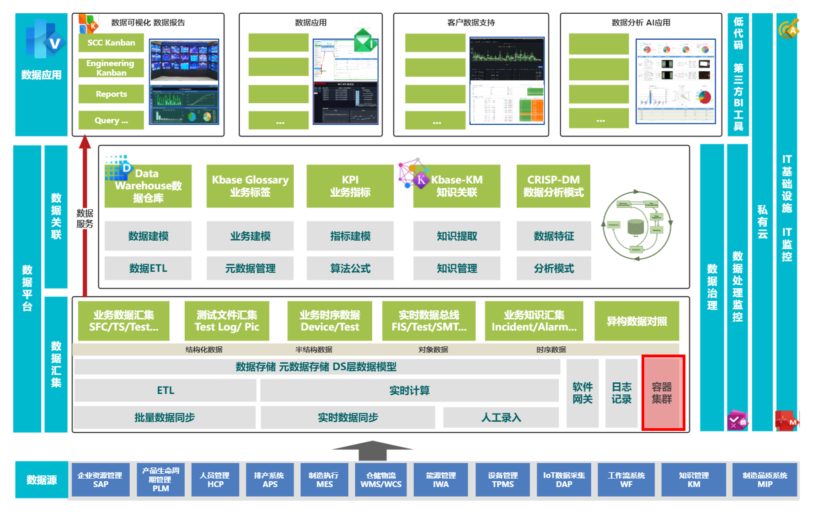
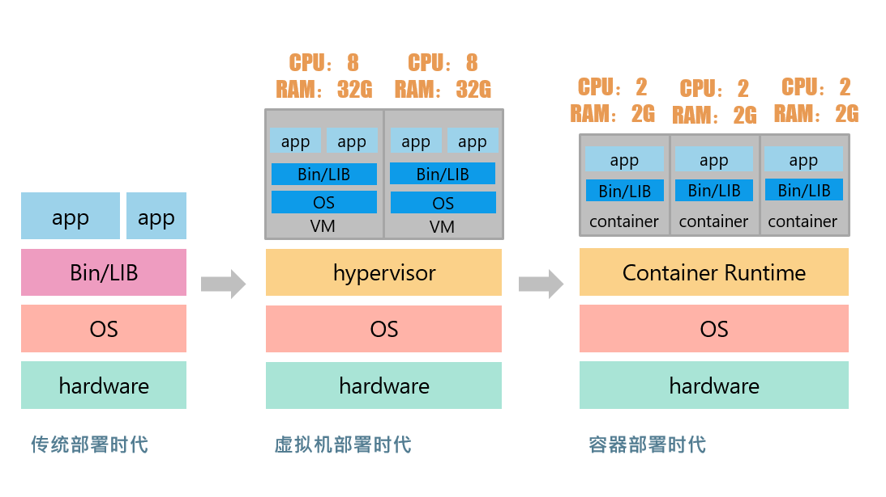
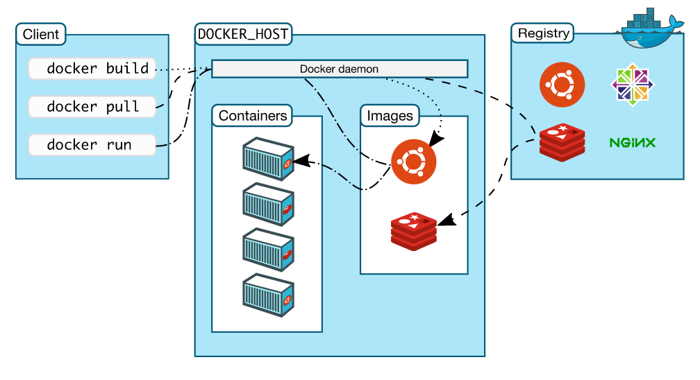

# Big Data Cloud Center Training BDCC培训课程

## 当前课程： I101 BDCC Infra Docker技术应用介绍    

### 讲师：梁巍
### 课程分类：

| 课程编号 | 分类         | 等级     | 版本 | 更新日期   |
| :------- | :----------- | :------- | :--- | :--------- |
| I101     | 平台基础设施 | 入门级别 | 1.0  | 2022-11-15 |


# 前言 Preface

我们现在提供的服务平台都是基于linux系统，使用容器部署的，本教程主要阐述容器和docker的基本概念和架构以及常用指令

## 课程受众

平台基础设施日常运维管理人员

## 课程目标

使受训人员可以对容器和docker有个基本认识，并能熟悉docker的常用指令，有助于日常运维。

## 课程在BDCC架构中的映射


# 课程内容

[TOC]

## 云原生与容器技术
容器化和云原生可以说是近几年最火的话题之一，容器化给应用程序的构建，管理和部署带来了极大的变革。

**云原生**：
- 简单的定义：云原生体系结构和技术是一种方法，用于设计、构造和操作在云中构建并充分利用云计算模型的工作负载
- 云原生基金会官方定义：云原生技术使组织能够在新式动态环境（如公有云、私有云和混合云）中构建和运行可缩放的应用程序。 容器、服务网格、微服务、不可变基础结构和声明性 API 便是此方法的范例。这些技术实现了可复原、可管理且可观察的松散耦合系统。 它们与强大的自动化相结合，使工程师能够在尽量减少工作量的情况下，以可预测的方式频繁地进行具有重大影响力的更改。

云原生是关于速度和敏捷性的。 业务系统正在从实现业务功能演变为加快业务速度和增长的战略转型武器。 必须立即将新想法推向市场。

同时，业务系统也变得越来越复杂，用户要求也越来越高。 他们希望实现快速响应、创新工作和零故障时间。 他们再也无法接受性能问题、反复出现的错误以及不能快速移动。 

云原生技术支持快速、频繁地更改应用程序，而不会影响服务交付，从而为采用者提供了创新的竞争优势。

**容器**：

容器是云原生的基石，是云原生应用程序中最基本的计算单元。

容器化是一种软件部署流程，可将应用程序的代码与应用程序在任何基础设施上运行所需的所有文件和库进行捆绑。通常，要在计算机上运行任何应用程序，必须安装与计算机操作系统匹配的应用程序版本。例如，您需要在 Windows 计算机上安装 Windows 版本的软件包。但是，借助容器化，您可以创建能够在所有类型的设备和操作系统上运行的单个软件包或容器，也可以很方便的从本地迁移到云上。

### 应用程序部署架构演变



- 传统部署：
早期，各个组织是在物理服务器上运行应用程序。 由于无法限制在物理服务器中运行的应用程序资源使用，因此会导致资源分配问题。 例如，如果在同一台物理服务器上运行多个应用程序， 则可能会出现一个应用程序占用大部分资源的情况，而导致其他应用程序的性能下降。 一种解决方案是将每个应用程序都运行在不同的物理服务器上， 但是当某个应用程式资源利用率不高时，剩余资源无法被分配给其他应用程式， 而且维护许多物理服务器的成本很高。

- 虚拟机部署：
因此，虚拟化技术被引入了。虚拟化技术允许你在单个物理服务器的 CPU 上运行多台虚拟机（VM）。 虚拟化能使应用程序在不同 VM 之间被彼此隔离，且能提供一定程度的安全性， 因为一个应用程序的信息不能被另一应用程序随意访问。

虚拟化技术能够更好地利用物理服务器的资源，并且因为可轻松地添加或更新应用程序， 而因此可以具有更高的可扩缩性，以及降低硬件成本等等的好处。

每个 VM 是一台完整的计算机，在虚拟化硬件之上运行所有组件，包括其自己的操作系统。因此虚拟机的体积和运行时本身占用的资源也是比较多的。

- 容器化部署：
容器类似于 VM，但是更宽松的隔离特性，使容器之间可以共享主机操作系统，和虚拟机的基于硬件的虚拟化不同，容器是基于操作系统的微型虚拟化。因此，容器不需要包括操作系统，比起 VM 被认为是更轻量级的。但是它又与 VM 类似，每个容器都具有自己的文件系统、CPU、内存、进程空间，容器之间是相互隔离的。

### 容器化部署架构
容器化系统由以下层组成。

**基础设施**
基础设施是容器模型的硬件层。其指运行容器化应用程序的物理计算机或裸机服务器。 

**操作系统**
容器化架构的第二层为操作系统。Linux 是一种使用本地计算机进行容器化的热门操作系统。 

**容器引擎**
容器引擎或容器运行时是一种基于容器镜像创建容器的软件程序。其作为容器和操作系统之间的中间代理，提供和管理应用程序所需的资源。现在发行的linux主流版本，已经都已经内置容器引擎了。 

**容器镜像**
容器化涉及构建自给自足的软件包，无论这些软件包在哪些机器上运行，性能都始终如一。软件开发人员创建和部署容器镜像，即包含运行容器化应用程序所需信息的文件。开发人员使用容器化工具根据OCI(开放容器计划：提供用于创建容器镜像的标准化格式)规范构建容器镜像。容器镜像为只读，计算机系统无法更改。docker就提供了符合oci标准的容器镜像的构建工具。

容器镜像是容器化系统的顶层

### 容器的优势
1. 便携性
软件开发人员使用容器化在多个环境中部署应用程序，而无需重新编写程序代码。他们只需构建一个应用程序，然后将其部署到多个操作系统上。
2. 可扩展性
容器是可以高效运行的轻量级软件组件。软件开发人员可以轻松在单个计算机上为不同的应用程序添加多个容器。容器集群使用来自相同共享操作系统的计算资源，但一个容器不会干扰其他容器的运行。  
3. 容错能力
软件开发团队使用容器来构建容错应用程序。他们使用多个容器在云上运行微服务。由于容器化微服务在独立的用户空间中运行，因此单个故障容器不会影响其他容器。这提高了应用程序的弹性和可用性。
4. 敏捷性
容器化应用程序在独立的计算环境中运行。软件开发人员可以进行故障排除并更改应用程序代码，而不会干扰操作系统、硬件或其他应用程序服务。他们可以缩短软件发布周期，并使用容器模型快速进行更新。

## docker是什么
Docker 提供了完整的工具和平台来管理容器的生命周期。是目前最主流的容器管理平台。 docker能够使软件开发人员在各种平台上快速的构建、部署、测试和使用容器化应用程序。

### docker架构
Docker使用客户端-服务器架构。Docker客户端与Docker守护进程进行对话，该守护进程完成了构建，运行和分发Docker容器的繁重工作。Docker客户端和守护程序可以在同一系统上运行，Docker客户端也可以连接到远程Docker守护程序。另一个Docker客户端是Docker Compose，它可以处理由一组容器组成的应用程序。



**docker daemon**
docker守护程序（dockerd）侦听docker client请求并管理docker对象。
**docker client**
docker客户端（docker）是docker用户与docker交互的主要方式。当使用docker命令时，比如docker run，客户端会将这些命令发送到dockerd，以执行这些命令。
**docker registries**
docker镜像仓库，用于存储docker镜像。docker hub是互联网上公共仓库，任何人都可以使用。在隔离网络的生产环境里，也可以自建私有的仓库。使用docker pull或docker run命令时，将从配置的仓库中下载所需的镜像。使用该docker push命令时，会将镜像推送到仓库中。
**docker image**
docker镜像是通过docker工具构建的，符合oci标准的容器镜像。

要构建镜像，需要创建一个Dockerfile，它使用一个简单的语法来定义创建和运行镜像所需的步骤。然后通过`docker build`命令来构建镜像。

```
简单Dockerfile 示例，构建一个nginx应用镜像。
# 1、第一行指定基础镜像信息
# 定制的镜像都是基于 FROM 的镜像，这里的ubuntu 就是定制需要的基础镜像。
# FROM <image>:<tag>
FROM ubuntu  

# 2、维护者信息
MAINTAINER docker_user docker_user@email.com

# 3、镜像操作指令
# RUN：用于执行后面跟着的命令行命令。 有以下俩种格式：
# shell 格式：RUN <命令行命令>
# exec 格式：RUN ["可执行文件", "参数1", "参数2"]
# 例如：RUN ["./test.php", "dev", "offline"] 等价于 RUN ./test.php dev offline
RUN echo "deb http://archive.ubuntu.com/ubuntu/ raring main universe" >> /etc/apt/sources.list
RUN apt-get update && apt-get install -y nginx
RUN echo "\ndaemon off;" >> /etc/nginx/nginx.conf

# 4、容器启动执行指令
CMD /usr/sbin/nginx
```
有了dockerfile，再通过docker build命令构建镜像


**container**
容器就是docker的运行时，是镜像运行起来的一个实例。我们可以使用docker客户端命令，创建，启动，停止，移动或删除容器

### docker客户端常用命令
常用的管理指令：

1. 运行容器：
```
docker run [OPTIONS] IMAGE [COMMAND] [ARG...]
例如：
$ docker run -d registry.inventec/infra/kong:2.2.0-alpine
```
2. 容器重启：
```
$ docker restart container-name
```
3. 容器停止，这里只是将容器停止，并未进行移除：
```
$ docker stop container-name
```
4. 容器开始,这里可以恢复一个停止的容器：
```
$ docker start container-name
```
5. 容器移除，一旦移除了容器，就无法使用start再重启，需要使用run命令重新运行容器：
```
$ docker rm container-name
```
6. 容器log查询，这里只会显示最近的log，需要查历史log，可以到监控系统查看：
```
$ docker logs container-name
```
7. 拉取容器镜像：
```
$ docker pull image-name
```
7. 推送容器镜像：
```
$ docker push image-name
```
### docker compose
docker compose也是docker的客户端，可以与docker deamon通讯，提交对容器的管理命令。Compose 是用于定义和运行多容器 Docker 应用程序的工具。通过 Compose，您可以使用 YML 文件来配置应用程序需要的所有服务。然后，使用一个命令，就可以从 YML 文件配置中创建并启动所有服务。YML文件的默认名称是`docker-compose.yml`

目前我们的大部分服务都是使用docker compose来进行部署的。

例子：
```
version: '2.3'
services:
  kong:
    container_name: kong
    image: registry.inventec/infra/kong:2.8.0-alpine
    restart: always
    networks: 
      - net
    ports:
      - 80:80
      - 8001:8001
    environment:
      - KONG_DATABASE=off
      - KONG_DECLARATIVE_CONFIG=/config.yml
      - KONG_PROXY_ERROR_LOG=/dev/stderr
      - KONG_ADMIN_ERROR_LOG=/dev/stderr
      - KONG_PROXY_ACCESS_LOG=/dev/null
      - KONG_ADMIN_ACCESS_LOG=/dev/null
      - KONG_PROXY_LISTEN=0.0.0.0:80,0.0.0.0:443 ssl
      - KONG_ADMIN_LISTEN=0.0.0.0:8001
      - KONG_ADMIN_LISTEN_SSL=0.0.0.0:8444
    volumes:
      - ./volume/config.yml:/config.yml
    sysctls:
      - net.core.somaxconn=10000
      - net.ipv4.tcp_keepalive_time=60
      - net.ipv4.tcp_keepalive_probes=3
      - net.ipv4.tcp_keepalive_intvl=10
      - net.ipv4.tcp_max_syn_backlog=8096
      - net.ipv4.tcp_tw_reuse=1 
  
  keepalived:
    container_name: keepalived-master
    image: registry.inventec/infra/keepalived:2.0.17
    restart: always     
    network_mode: host
    volumes:
      - "./volume/keepalived-master.conf:/container/service/keepalived/assets/keepalived.conf:ro"
      - ./volume/checkkong.sh:/checkkong.sh   
    command: --loglevel debug --copy-service

networks:
  net:
    external:
      name: infra
```

常用命令：
1. 部署和运行容器
```
$ docker-compose up -d
这个命令会使用当前路径下的docker-compose.yml文件来部署和运行容器。

也可以指定yml文件，比如yml文件名称为docker-compose-kong.yml,则可以使用下面这个命令部署和运行
$ docker-compose -f docker-compose-kong.yml up -d
```
2. 停止并移除容器
```
$ docker-compose down
这个命令会把docker compose中定义的容器全部移除掉，并释放容器占用的资源。
```

关于docker命令和docker compose命令，详细的细节可以参考[官方说明文档](https://docs.docker.com/engine/reference/commandline/docker/)

# 课后问题
1. 请简述你理解的容器
2. 请简述容器的优势
3. 请简述docker是什么以及docker镜像是什么
4. 请写出docker 重启，停止，启动命令，docker compose的部署运行命令，docker compose的停止移除命令

# 讲师邮件地址

liang.wei@inventec.com