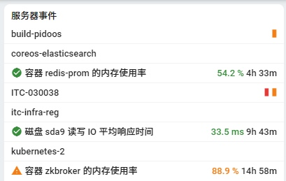

# Big Data Cloud Center Training BDCC 培训课程

 

## 课程题目：I110 BDCC Infra Monitor 监控介绍

| 课程编号 | 分类         | 等级     | 版本 | 更新日期   |
| :------- | :----------- | :------- | :--- | :--------- |
| I110     | 平台基础设施 | 入门级别 | 1.0  | 2022-11-15 |

### 课程受众与目标

- **IT 运维人员**，了解使用 Infra-Montir 查看 BDCC 物理节点、服务容器资源消耗、发现瓶颈的基本方式。
- **大数据方案工程师**，了解使用 Infra-Monior 查看数据任务运行状态的基本方式。

### 课程在 BDCC 架构中的映射

[Toc]

# 课程内容

## 概览

基础设施监控服务**Infra-Monitor**是面向 IT 管理员，对大量 IT 基础设施进行监控的工具。目的是辅助管理员及时发现可用性异常，分辨系统瓶颈，以便提前执行一些管理动作。主要功能包括：

- 典型 IT 基础设施监控：
  - Windows、Linux 系统，包括 CPU、内存、磁盘 IO、网络流量等信息。
  - Windows 服务，系统服务的运行状况。
  - Linux 下容器资源使用，包括 CPU、内存、磁盘 IO、网络流量等信息。
  - 支持针对监控数据，对每个节点设定警告、严重阀值。
- 监控看板聚合
  - 支持把常用服务监控视图嵌入显示，避免 IT 管理员额外记录地址。
- 数据任务（Dkron、Kettle）的管理
  - 查看数据任务的执行状态、输出内容、执行历史。
  - 增加、编辑数据任务。

服务地址，http://bdcc-infra-monitor.sz.chiconypower.com.cn

### 登录

支持本地账号、或者接入 DAuth 使用域账号登陆；默认本地 admin 有管理员权限，其他用户为只读操作，需要额外授权。

## 首页监控面板

监控管理服务首页，作为整个基础设施可视化面板，提供服务器概览、事件列表、监控卡片等区域。

### 监控卡片

将 IT 管理员需要持续关注的性能数据，以卡片的形式放置在监控面板主体区域。

卡片内容包括：

- 用户关心的服务器性能指标，显示过去 1 小时的性能曲线、当前性能值、与平均值相比的增减百分比；用户可以在服务器详细信息里添加关注的性能卡片。
- 节点在线状况，同时显示 1 小时内的在线百分比（ping 通百分比）和平均响应时间。
  - 点击节点，可以直接跳转到服务器、网络设备详细信息。
- 服务器磁盘空间使用百分比。
  - 点击节点，可以直接跳转到服务器详细信息。

### 事件列表

显示服务器正在发生的警报的事件，和过去 12 小时恢复正常的事件。

#### 事件详细信息

显示运维事件的详细信息

- 事件对应的性能指标，从超限到恢复正常整个范围的图表。
- 事件的统计信息，包括起始时间、持续时长、性能值的当前值、最大值、平均值等。
- 提供此性能指标过去一周、过去一个月的历史图表，用于管理员参考。
- 提供入口让管理员调整警报设置。

## 服务器管理

列出正在监控的所有基础设施的节点，支持通过字串、标签对服务器进行搜索和过滤。

显示服务器概要信息，包括名称、IP、等级、标签。

### 服务器详细信息

查看配置服务器详细信息

- 服务器摘要信息，包括名称，标签等。
- 服务器资源，显示 CPU、内存、存储、网络等资源监控历史。

- 服务器等级，对于运行容器的 Linux，会把容器的资源监控单独标签显示。
- 服务器配置，用户设置服务器重要等级，归属资源组，IP 地址信息等。

#### 服务器监控代理

目前，服务器监控数据是通过部署 Telegraf 监控代理实现数据上报的：

- Windows 下部署为服务
- Linux 下使用容器运行

> 这部分会在后续课程介绍：《 I200 BDCC Infra 运维方法-指标监控 》

### 警报设置

允许管理员对性能指标的警告、严重阀值进行设置，另外还可以配置是否以性能卡片的形式展示在监控面板上。

### 历史图表的显示时段

除了快速查看时段，还支持扩展选择其他查看范围；目前仅支持这些相对时间范围。

## 监控看板聚合

目前，基础设施众多服务集群，还有一些基于 InfluxDB/Prometheus 采集数据，使用 Grafana 直接创建的服务看板。为了便于管理员一站式查看，也把这些看板直接嵌入 Infra-Monitor 显示。

目前这个监控看板列表是服务配置，稍后会提供添加、编辑功能。

> 每个看板的详细使用，会在后续课程介绍：《 I200 BDCC Infra 运维方法-指标监控 》

## 数据任务调度管理

面向大数据后台数据同步任务的调度、管理；目前主要支持 Kettle 任务的调度与输出解析。

### 任务列表

持任务配置、运行状态的概览。

- 支持任务运行历史图，识别任务分布状况。
- 支持以 running/error 来过滤正在运行、有业务错误的任务。

### 任务详细信息卡片

- 任务概览：每天调度频度，成功、失败次数，任务平均运行时间等信息。
- 当前状态：任务正在运行状态，或者最后一次运行的解析结果；可以展开任务完整输出，以便详细分析。
- 执行历史：任务短期历史概览，目前服务只缓存过去 3 天执行历史。
- 任务配置：提供对任务调度参数等配置的修改，跟任务创建相同。

### 添加、编辑任务

支持创建符合 BDC 规则的数据任务，目前大多是 Kettle 类型 ETL 任务，直接脚本任务。

#### 任务资源

目前任务执行使用的脚本、依赖的资源文件，都是维护在 OSS 服务的 `dkron-resource` 下，并且实时同步到各个 Dkron 服务节点上，保证任务被调度到任一节点上都可以正常执行。

## 用户权限管理

用于管理用户角色及可见的资源，用户可以进行资源读写权限，可管理资源组。目前只有管理员用户可以修改其他账号的权限及资源组配置。

用户管理页面，显示所有已经登陆过的用户。

- 用户名称，自动登陆账号标识，最后登录时间。
- 设置用户角色，分管理员和普通用户。
- 对资源类管理对象（比如服务器、数据任务、在线监测节点，高可用服务、网络设备等），支持读写权限控制。
- 资源组，可以设置用户管理不同资源组。

对于资源类管理对象，在配置页面可以设置归属组。

# 课后内容

### 课后问题

1. 请简述，如何给一个服务器 D 盘 读写响应延迟设定 `100ms` 的警告阈值，并且放到首页观察。
2. 请简述，如何增加一个数据库同步任务。

### 讲师联系方式

- 姓名：闫硕
- 邮箱: yan.shuo@inventec.com
