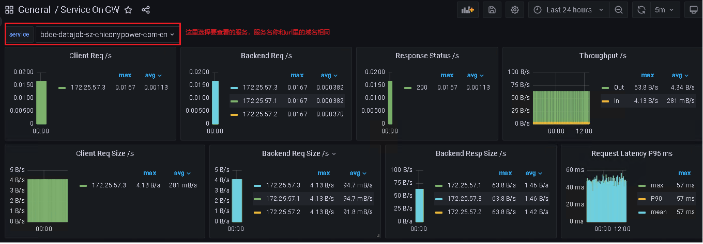
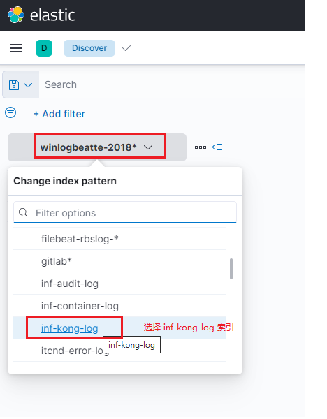
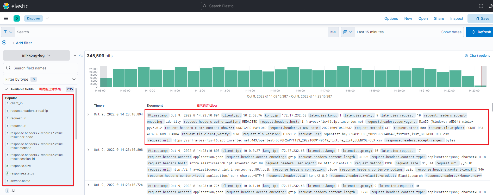
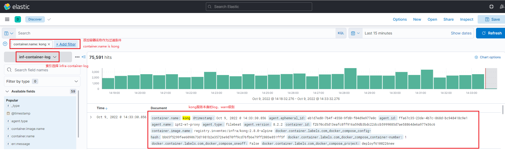

# 平台基础设施监控

[TOC]

## 概述

## 应用

### Infra Monitor

### HOST

### API Gateway

##### 主要指标监控看板

图示：
首先选择要查看的服务名称


指标列表：

| 指标名 | 指标值 | 参考值 | 说明 |
| --- | --- | --- | --- |
| Client Req /1m | 20/m | - | 客户端每分钟的请求数。包括客户端ip，以及该客户端的每分钟请求数 |
| Backend Req /1m | 20/m | - | 上游服务端每分钟收到的请求数。包括服务端的ip，以及该服务端每分钟收到的请求数 |
| Response Status /1m | 200：100/m | - | 请求返回的状态码统计。包括返回的状态码，以及每分钟返回该状态码的数量有多少个。返回的状态码，400以上的情况应该是极少数（<10%），如果出现多数异常，可以根据状态码，排查对应的异常。 |
| Throughput /1m | 20MB/s | - | 每分钟的平均数据流量。包括请求流量In：xxMB/s,响应流量Out：xxMB/s |
| Client Req Size /1m | 500kB/s | - | 客户端每分钟的平均请求数据量。包括客户端ip，以及该客户端每分钟的平均请求流量 |
| Backend Req Size /1m | 500kB/s | - | 上游服务端每分钟收到的平均请求数据量。包括服务端的ip，以及该服务端每分钟收到的请求流量 |
| Backend Resp Size /1m | 5MB/s | - | 上游服务端每分钟响应的平均请求数据量。包括服务端的ip，以及该服务端每分钟响应的请求流量 |
| Bad Response from Client | 0 | 绝大多数时间是0 | 异常响应的数量统计。包括收到的异常响应的响应码，以及收到异常响应的客户端ip，以及异常响应的数量 |
| Request Latency | 1s | - | 上游服务处理请求所用的时间。绝大多数情况应该是秒级，如果出现几十分钟或者更高延迟，可优先怀疑和排查上游服务的响应效率 |
| Bad Request URL access | - | - | 异常请求的url统计。主要包括返回状态码，以及对应的请求的url，便于查到具体异常的请求。 |
| Request URL access | - | - | 正常请求的url统计。主要包括状态码，以及对应的请求的url。 |

参见: [Service On GW](http://bdcc-infra-grafana.sz.chiconypower.com.cn/d/54h9af4hjafgasfd9g76af7h/service-on-gw?orgId=1&refresh=5m)

***常见异常状态码排查***
| 状态码 | 描述 | 排查 |
| --- | --- | --- |
| 400 | 客户端请求的语法错误，服务器无法理解 | 客户端请求的数据格式是否正确，或者请求header是否正确 |
| 401 | 请求要求用户的身份认证 | 客户端未认证 |
| 403 | 服务器理解请求客户端的请求，但是拒绝执行此请求 | 客户端请求数据格式是否正确，请求的header是否符合要求 |
| 404 | 服务器无法根据客户端的请求找到资源 | 客户端请求的url是否正确 |
| 500 | 服务器内部错误，无法完成请求 | 先排查kong是否运行异常，可通过log查看。然后排查上游服务是否异常 |
| 502 | 作为网关或者代理工作的服务器尝试执行请求时，从远程服务器接收到了一个无效的响应 | 先排查上游服务是否正常，再排查kong是否存在异常 |
| 503 | 由于超载或系统维护，服务器暂时的无法处理客户端的请求 | 排查上游服务是否异常 |
| 504 | 充当网关或代理的服务器，未及时从远端服务器获取请求 | 先排查kong是否运行异常，再排查上游服务是否异常 |

##### 详细log查询

这里的log查询，主要是针对GW的核心服务kong的log查询，主要查询两个方面。一个是针对所有请求的log查询，一个是针对kong服务本身的log查询。

- 请求的log查询

针对所有请求的log查询，可以协助定位出现异常的上游服务。

使用kibana查询

先选定inf-kong-log索引


然后根据需求，选择设置过滤字段，查看请求的详细log


- kong容器服务本身的log查询

kong容器log的查询，主要是排查kong服务本身的异常。

直接在部署主机查询，可以查到最近的log数据
```
docker logs kong
```

使用kibana查询可以查到更早的log数据




参见: [kibana](http://bdcc-kibana.sz.chiconypower.com.cn)

##### 主要运维方法

GW服务本身异常，主要的快速恢复方式就是重启

在部署主机上执行命令：`docker restart kong`

或者更彻底的，先销毁，再重建，在部署路径下（一般是serviceGW路径），先执行`docker-compose down` ，然后`docker-compose up -d`

### Minio

### Greenplum

### PostgreSQL

### Kafka

### Flink

### Dkron

