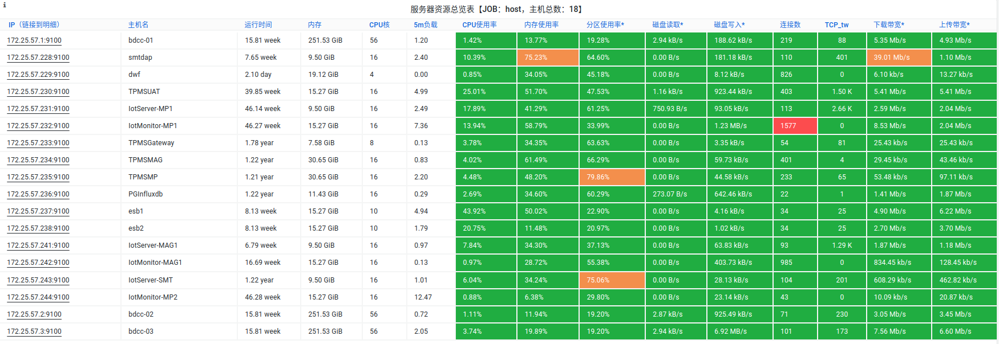

# 目录

[TOC]

## 服务巡检综述

- 当前已接入 18 个 Linux VM/Host 节点，覆盖 TPMS / DAP / BDCC 等服务的运行环境
- 基础服务监控覆盖 Greenplum / PostgreSQL / Kafka / Minio / Gateway 等使用中服务
- 当前数据平台 ODS/DW/DM 数据已积累 300G，可视化部分逐步完善

## 服务运行状态

### IASS 平台

#### Linux Host / VM

| 指标名 | 指标值 | 参考值 | 说明 |
| --- | --- | --- | --- |
| 接入 Linux 节点数 | 18 | - | 已涵盖所有 TPMS/DAP/BDCC 节点 |
| 最近 7 天重启次数 | 1 | - | dwf 节点最近两天有过一次重启 |  
| CPU总使用率 | 10% | - | |
| 内存总使用率 | 21.7% | - ||
| 磁盘总使用率 | 2.75% | - ||
| CPU使用率超70%的节点 | 0 | 0 ||
| 内存使用率超70%的节点 | 1 | 0 | 需要关注节点: smtdap |
| 分区使用率超70%的节点 | 2 | 0 | 需要关注节点: TPMSMP/IotServer-SMT |
| TCP连接数超1K的节点 | 1 | 0 | 需要关注节点: IotMonitor-MP1 |
| TCP_TW连接数需关注的节点 | 0 | 0 |  |

参考: [Infra Host](http://bdcc-infra-grafana.sz.chiconypower.com.cn/d/9CWBz0bik/infra-host)

### 数据同步

#### 数据库同步方式系统对接 -- Infra Monitor 任务管理

对接 MES / WMS 系统数据库采用了 DB 数据同步方式，实现以表为粒度进行同步。

| 任务名称 | 任务类别 | 执行成功次数 | 执行失败次数 | 任务执行周期 | 说明 |
| --- | --- | --- | --- | --- | --- |
| mesdb2pg_data_sync | KETTLE | 1465 | 32 | @every 1h | 涉及 MESDB 中 82 张表  
| mesdb2pg_data_sync_30m | KETTLE | 3344 | 2 | @every 30m | 涉及 MESDB 中 2 张表(G_SN_STATUS/G_SN_TRAVEL)
| wmsdb2pg_data_sync | KETTLE | 1470 | 33 | @every 1h	| 涉及 MES(WMS) 中 10 张表及视图
| dw_func_common | PSQL | 1682 | 0 | @every 1h	| 涉及 9 个 function
| dm_func_scc | PSQL | 3340 | 0 | @every 30m | 涉及 4 个 function

参考: http://bdcc-infra-monitor.sz.chiconypower.com.cn/datajob

#### 共享目录方式系统对接 -- DCAgent + SHELL

对接 SAP / WF 系统数据文件采用了文件监听加导入的方式，共享目录下 WF 数据文件累计 2875 个，SAP 文件累计 52 个，均已处理。

参考: [DCAgent](http://bdcc-infra-grafana.sz.chiconypower.com.cn/d/000000002/dcagent)

#### 消息队列方式系统对接 -- Kafka

对接 DAP 外部系统走了 Kafka 日志总线，承接比如 SPI 的日志上传。

#### 网页上传方式数据接入 -- DAVI

针对自定义 Excel 文件（非系统生成），走文件手动上传方式进行导入，不过该方式需要依赖消息总线 Kafka。

? 用户是否上传文件？上传了多少？是否有失败？

#### 第三方接口方式系统对接 -- 自定义开发

对接 微信小程序的云端数据库 采用了该方式

### 流计算平台

#### 日志文件上传总线 -- Kafka 

| 指标名 | 指标值 | 参考值 | 说明 |
| --- | --- | --- | --- |
| 运行版本 | 5.5.7 | - |  |
| 运行时长 | 14.4 week | - |   |
| 最近 7 天重启次数 | 0 | - | 
| Total of Topics | 21 | - | 覆盖业务包括 DAP/DAVI/Kbase/InfraMonitor |
| Online Partitions | 350 | - | |
| Offline Partitions | 0 | 0 | 没有出现异常的分区 |
| Under Replicated Partitions | 0 | - | |
| ISR Shrink | 0 | 0 | 暂时没发生过抖动 |
| ZooKeeper Connection Expires | 0 | 0 | 暂时没发生过抖动 |
| Partitions Per Broker | 116/116/118 | - | 节点负载基本均衡 |
| Partitions Leader and Replica Per Broker | 39/41/42 | - | 节点负载基本均衡 |
| 集群每秒核心请求数 | 200/s | - |  |
| 集群每分钟错误请求数 | 0 | 0 | 最开始存在 `UNKNOWN_TOPIC_OR_PARTITION` 异常，之后消失了，预计是之前开发人员没有创建好 Topic |
| NetworkProcessorAvgIdlePercent | >99% | >90% | |
| RequestHandlerAvgIdlePercent | >99% | >90% | |
| Produce Latency (99th) Per Broker | <10ms | <20ms |  消息推送时延低于 10ms |
| OffsetCommit Latency 99th Per Broker | <20ms | <100ms |  OffsetCommit 正常，即便出现消息消费问题也是业务自身问题 |
| Bytes In / Out Per Broker | <10kB/s | - |  流量较低 | 
| LogCleaner最长执行时间 | 0 | <30s | Kafka集群还没缓冲大量的数据，执行都很快，暂时没采集到该指标 | 

参考: [Kafka Cluster](http://bdcc-infra-grafana.sz.chiconypower.com.cn/d/5nhADrDWk/kafka-cluster)

#### Flink

| 任务名称 | 运行时间 | 说明 
| --- | --- | --- |
| | | |

### 数据存储

#### 实时数据库 - PostgreSQL

| 指标名 | 指标值 | 参考值 | 说明 |
| --- | --- | --- | --- |
| 运行版本 | 12.10.0 | - | |
| 运行时长 | 10.1 week | - | |
| 最近 7 天重启次数 | 0 | - | |
| 集群节点数 | 3 | - |1 Master / 2 Standby |
| 主从同步状态 | 正常 | - | |
| 数据库DB数 | 6 | - |`chicony`/`dauth`/`davi`/`grafana`/`ikanban`/`kbase` | 
| 数据库连接 | <100 | - | |
| 数据库TPS | <50 | - | |
| 数据库最长事务 | 2.5min | - | 出现分钟级别的事务是因为 dw_func_common 数据整理任务从执行第一个存储过程到最后一个都属于一个事务，所以达到分钟级别在预期范围之内，暂不关注 |
| 缓存命中率 | 80%~99.9%  | 99% | 除 chicony 库(同步数据)缓存命中率较低外，其他业务库都能维持在 99% 以上，chicony 库的缓存命中率低是因为当前主要还是写入和更新操作居多，看板等业务应用还很少 |
| temp_buffer是否出现溢出 | 是 | 否 | 偶发，常发生于数据堆积的时候，暂不关注 |
| 数据库大小 | **≈300GB** | <1T |  |
| 数据库增长量 | **≈15GB/w** | | |

参考: [PostgreSQL Cluster](http://bdcc-infra-grafana.sz.chiconypower.com.cn/d/DZQosBxMk/postgresql-cluster)

#### 数仓(结构化数据) - Greenplum

| 指标名 | 指标值 | 参考值 |说明 |
| --- | --- | --- | --- |
| 运行版本 | 6.20.5 | - |  |
| 运行时长 | 14.4 week | - |  |
| 最近 7 天重启次数 | 0 | - | | 
| 集群节点数 | 6 | - | 3个 segment host，6个 primary segment |
| 集群节点状态 | 正常 | 正常 | 没有 Down 或者角色切换的节点 |
| 数据库DB数 | 1 | - | `chicony` | 
| 数据库连接 | <10 | - | 当前只有一个 Flink 任务写入数据库，所以连接数很少 |
| 数据库最长事务 | 1s | - | 因仅接入了SPI少量日志，数据整理操作在入库前已完成，暂无需优化的SQL |
| 数据库是否发生过阻塞 | 否 | 否 | 暂没有发生过因为表锁引起的数据库阻塞 |
| 数据库溢出文件数 | 0 | - | 如果有溢出文件，说明执行 SQL 时分配的内存不足，待优化数据库配置或优化 SQL |
| 数据库大小 | **≈5GB** | - | |
| 数据库增长量 | **≈2GB/w** | - | 数据增量较低，目前可忽略 |

参考: [Greenplum](http://bdcc-infra-grafana.sz.chiconypower.com.cn/d/wsZrd9MMk/greenplum)

#### 文件存储 -- Minio

目前用于存储 PG 备份数据，安装包文件存储(方便部分包离线安装)，暂时用量不大，目前可忽略。
