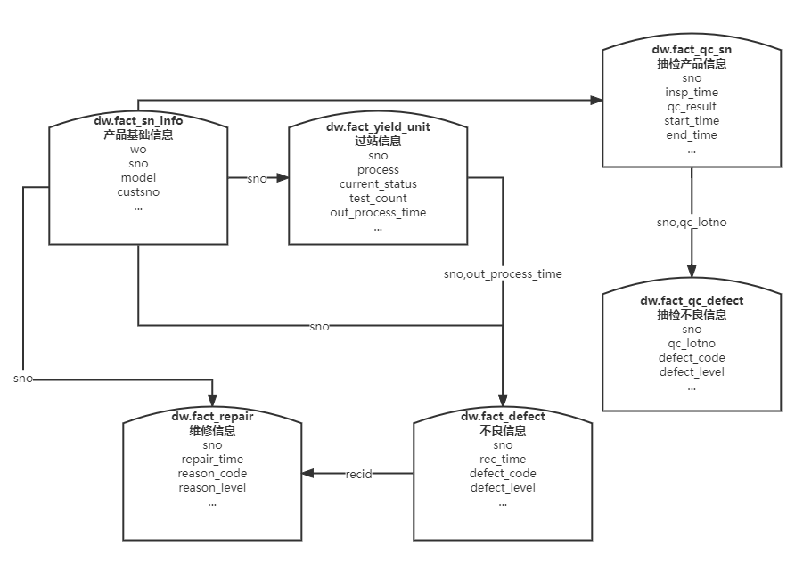

# 数据模型概要设计和应用

* [1 数据模型分类](#1)

* [2 模型层级结构](#2)

* [3 数据建模基本流程及实现方式](#3)
* [4 数据血缘](#4)

<h2 id="1">1. 数据模型分类</h2>

### 概念数据模型

第一级是“全局”模型，表示整体结构和内容。是在了解了用户的需求 , 用户的业务领域工作情况以后 ,
经过分析和总结 , 提炼出来的用以描述用户业务需求的一些概念的东西。可以理解为业务域的划分。

### 逻辑数据模型

第二级是逻辑数据模型。逻辑模型是将概念模型转化为具体的数据模型的过程，旨在描述数据流和数据库内容。

### 物理数据模型

第三级是物理数据模型。物理模型就是针对逻辑模型所说的内容 , 在具体的物理介质上实现出来 ,表 、视图、
字段、 数据类型、 长度、主键 索引、约束、是否可为空、默认值等均在该阶段需完成。

<h2 id="2">2. 模型层级结构</h2>

# 

### ODS(Operational Data Store) 原始数据层

原始数据层存储的是面向业务系统的数据，也是最接近数据源中数据的一层，数据源中的数据，经过抽取、洗净、传输，也就是传说中的 ETL 之后，装入本层，主要数据包含业务DB数据、日志解析数据、上传文件等。

### DW(Data Warehouse) 数仓层

DW是数据仓库的核心，从ODS层中获得的数据按照主题建立公用的数据中间层，用以减少应用层反复树烟筒的情况。

对ODS层进行数据清洗、过滤、规范化、重组，用以方便数据的使用，可以考虑部分信息的冗余。
一般采用维度模型方法作为理论基础，更多的采用一些维度退化手法，将维度退化至事实表中，减少维度表与事实表的关联，提高明细数据表的易用性；同时在汇总数据层要加强指标的维度退化，采用更多的宽表化手段构建公共指标数据层，提升公共指标的复用性，减少重复加工。

* 一致性

相同业务含义的字段名称、数据类型、数据内容需保证一致

* 唯一性

删除重复数据，保证业务主键的唯一

* 规范性

规范栏位类型、长度，清洗空格、大小写差异等数据，明确业务主键，增加写表时间与改表时间栏位

* 通用性

各模型不针对具体报表设计，面向业务主题进行建模

### ADS(Application Data Service) 数据应用层

主要面向报表、BI、数据分析挖掘等场景，一般相对定制化。

<h2 id="3">3. 数据建模基本流程及实现方式</h2>

### 1. 概念模型定义

* 结合群电前期品质类报表任务需求，构建如下品质相关概念模型

| 概念模型   |
|--------|
| 产品基础信息 |
| 过站信息   |
| 不良信息   |
| 维修信息   |
| 抽检信息   |
| 良率统计   |

### 2. 逻辑模型定义

* 将概念数据类映射至DB数据结构。对于概念数据模型中确定的数据概念和复杂数据关系，给予更详细地描述,构建ER关系图

# 

### 3. 物理模型定义

* 根据逻辑模型，梳理ODS层关系，整合至DW物理实体表，并对栏位进行相应的规范，备注栏位描述
* 为方便应用层使用，物理模型中会存在一定程度的维度指标冗余

# 

# 

### 4. 模型整理

* PG Function是实现数据模型的一种方法，在Function中使用PGSQL将ODS层的数据进行整理、合并，构建通用的模型实体表，通过定时Job或CDC实时触发的方式整理相关主题模型

### 5. Log记录

* 在Function中记录log，包含Function每次执行的执行时间、执行耗时、处理数据量等内容，可根据这些指标判定Function是否正常运行，记录峰值点，从而调整Job的调度时间，错开高峰
# 

### 6. 数据更新机制

1. 根据业务主键及更新时间戳增量整理
* 优点：若每次修改时间戳都会变更，则更新机制会较为准确
* 缺点：对于大数据量上游表整体效率相对较低，需要每次与模型表关联核对时间戳是否有变更

2. 对于大数据量且增量追加模型(过站Log模型)，根据上次执行的最大时间戳增量追加整理
* 优点：对业务主键可以不做要求，执行效率相对较高，适用于大数据量上游表的整理
* 缺点：需要保证整理表的源头为增量追加的方式，若表存在Update，则此方式不适用

3. 全量同步
* 优点：不依赖于业务主键及更新时间戳，保证每次数据整理的完全准确
* 缺点：执行效率低，一般存在业务主键及更新时间戳的源头表都不建议采用此更新方式

4. CDC触发
* 优点：精准定位到上游变更的数据，仅对变更信息进行整理，效能、实时性、准确性均为最优选择
* 缺点：对上游表主键的要求较高

<h2 id="4">4. 数据血缘</h2>

* 数据的产生、加工融合、流转流通，到最终消亡，数据之间自然会形成一种关系。我们借鉴人类社会中类似的一种关系来表达数据之间的这种关系，称之为数据的血缘关系。与人类社会中的血缘关系不同，数据的血缘关系还包含了一些特有的特征：
归属性：一般来说，特定的数据归属特定的组织或者个人，数据具有归属性。
### 1. 多源性
同一个数据可以有多个来源（多个父亲）。一个数据可以是多个数据经过加工而生成的，而且这种加工过程可以是多个。
### 2. 可追溯性
数据的血缘关系，体现了数据的生命周期，体现了数据从产生到消亡的整个过程，具备可追溯性。
### 3. 层次性
数据的血缘关系是有层次的。对数据的分类、归纳、总结等对数据进行的描述信息又形成了新的数据，不同程度的描述信息形成了数据的层次。

# 
