[TOC]

# Grafana主要控件配置详解

## Grafana简介

Grafana是一个开源的BI平台，在主流的开源BI平台中，它在对接时序数据库，分析展示监控数据的方面做得最好。

Grafana有着非常漂亮的图表和布局展示，功能齐全的度量仪表盘和图形编辑器，经常被用作基础设施的时间序列数据和应用程序分析的可视化，目前支持的数据源包括 InfluxDB、Elasticsearch、Graphite、Prometheus 等，同时也支持 MySQL、MSSQL、PG 等关系数据库。

Grafana支持许多不同的数据源。每种数据源的查询语言和功能明显不同，但Grafana 为不同数据源提供了不同的编辑器，这样可以方便使用特定数据源的查询语法。这一点上它超越了许多的竞争对手。Grafana 可以将来自多个数据源的数据组合到一个Dashboard上，甚至可以组合到一个Panel上，这样就拥有了从不同系统的数据库中获取数据进行展示的能力。

作为一款开源软件，Grafana除了提供一组官方显示控件外，还有着庞大的第三方控件。比如阿里云的Grafana服务就整合了过百个控件。控件丰富的好处自然是总能找到符合需要的控件，但同时也有相应的缺点，那就是控件良莠不齐，很多开发者只满足了自己的单一场景需求，并没有考虑通用性。这样当使用者使用某个控件搭建起视图后，往往会因为一些显示上的需求试来试去，花费大量时间最终却不得不更换另一个控件来重新制作。

在对Grafana使用的积累中，我们也遴选出一批相对较通用的三方控件，加上我们自己开发的一组控件和官方控件，组成了我们现在使用的控件库。这套控件库可以满足大部分的需求，过于特殊的需求我们还是要通过写前端代码来实现。

## Grafana基础设定

### 1. 数据源的配置

Grafana以控件的方式提供了各种主流的数据库、云端数据库，以及CSV、Google Sheets这类文件数据源的支持。

当需要连接一个新的数据源时，可以通过左边的菜单进入数据源管理页面

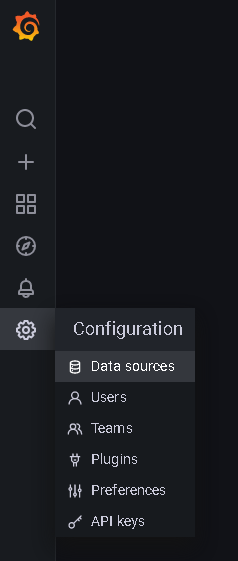

接下来，选择 *Add Data Source* 按钮，再选择与数据源对应的控件，进入配置页面。

我们以Postgre数据源为例，配置界面如下：

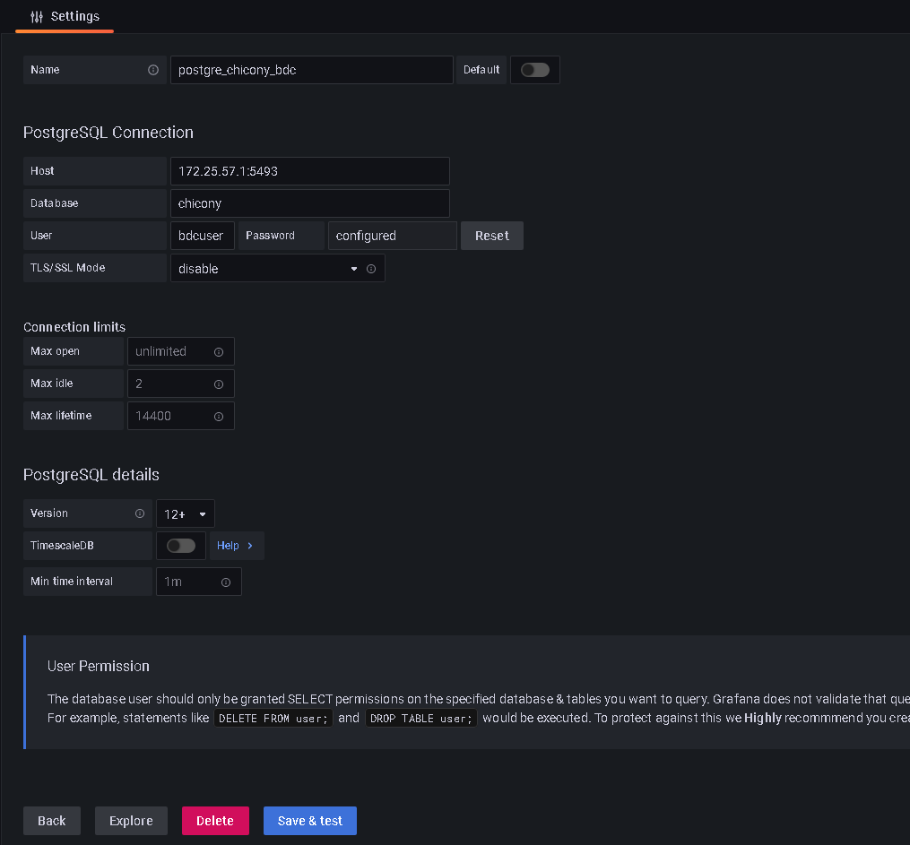

通常来说，只需要正确输入数据库相关信息，然后点击*Save & Test*按钮，弹出绿色的对话框提示连接成功，就可以了。

进阶一点的使用，也可以设置连接数的限制。

对于我们部署的Postgre数据库，可以通过5493和5494两个端口来区分成两个数据源。其中5493端口提供读写权限，5494端口提供只读权限。如果查询代码或者调用的function中用到了临时表等操作，就应该是用5493端口的数据源。

### 2. 用户的管理

用户管理页面，同样是从左侧的菜单进入。

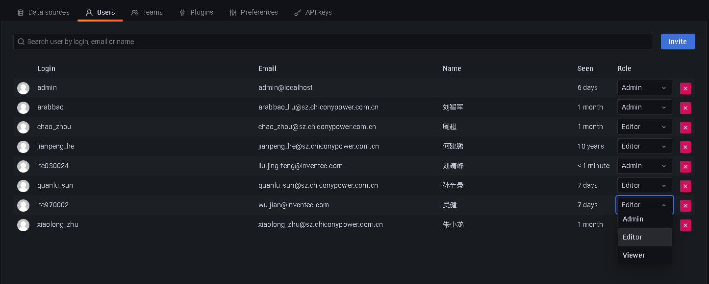

在这里的操作包括添加、删除用户，和给用户配置不同的Role。

> Admin用户有权限进行配置的变更和页面的编辑；

> Editor用户有权限进行页面的编辑；

> Viewer用户只有权限观看页面。

通过对ini的配置，可以指定Grafana的某个org允许匿名访问。匿名访问和Viewer用户还是有一些不同的，匿名访问者必须通过确定的URL地址才能正确访问到页面；而Viewer用户可以通过浏览各个目录，根据页面的名字找到他需要访问的页面。

Grafana也提供了基于用户组的权限管理模式。在Teams Tab可以设置群组，这样可以便于给一组用户赋同样的权限。

### 3. 控件的管理

Grafana的配置页面虽然有plugin Tab，但是这个页面并不提供控件的增加和删除等管理操作。

控件一般是从GitHub上下载，然后在server端通过命令行安装的。

我们在这个页面可以列出全部的控件，其中Panel类的控件共有125个，点击每个控件都可以跳转到它的说明页面，有些控件还有进一步的文档链接。但是这些文档通常语焉不详，即使是Grafana官方控件，文档也难称详尽，还是需要使用者摸索的。

> [这是一个典型的Grafana官方控件的文档地址，基本没什么帮助](https://grafana.com/docs/grafana/latest/visualizations/bar-gauge-panel/)

所以我们在后面提供了部分控件的简单介绍，但绝大多数控件还是需要自己摸索一下才能熟悉。

### 4. 其它配置

在配置的Preferences Tab里，可以设定时区和主题。

Grafana提供的主题只有Dark 和 Light两种，一般默认是Dark，即黑底色主题。

对于单个页面，也可以在URL里通过加上 *&theme=Light* 来强制它显示白底色主题。

Grafana有Folder的概念，可以把不同页面放在不同的Folder下；可以针对Folder来对用户或用户组设置权限。

当把一个页面从某个Folder移到另一个Folder去时，页面的URL并不会变化。

所以建议在某个权限比较严格的Folder下面搭建新页面，完成后再移到其他Folder里。

## 使用Grafana开发页面

### 1. 建立一个新页面

建立一个新页面，最直接的方法是在左侧的菜单栏，选择Create 一个页面

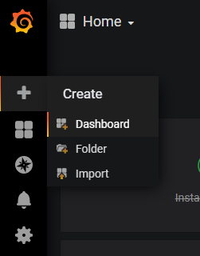

然后在新打开的页面里选择 *Add an empty panel*

然后配置这个panel，再保存，新页面就完成了。

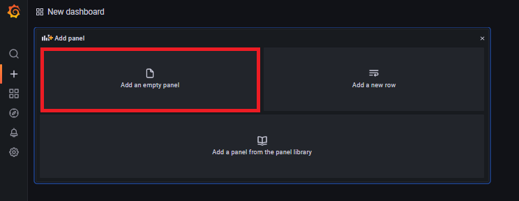

### 2. 配置一个Panel的显示

在选择*Add an empty panel*之后，Grafana会跳转到panel的编辑界面；

对已经存在的panel，点panel顶部的下拉菜单，选择*Edit*，也会进入这个panel的编辑界面。

对于一个新的panel，默认会显示panel列表里的第一个，也就是Grafana官方的Time Series控件，我们需要自己去切换成需要的控件。

点这里，会展开我们整合的全部125个显示控件。

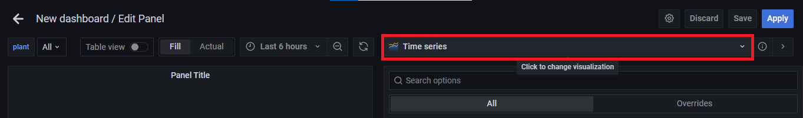

可以看到，除了使用滚动条上下移动找到所需控件外，我也可以使用关键字查询需要的控件。

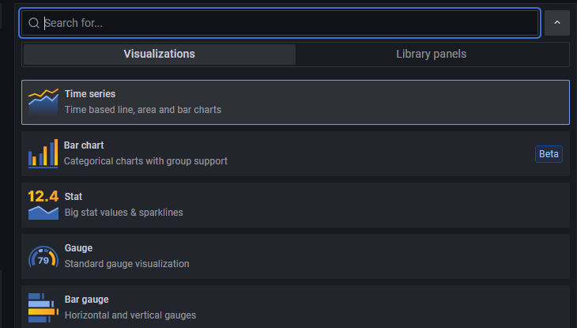

选择控件后，在编辑界面的Query页来设置查询数据的sql

- 通过下拉框选择数据源

- 查询结果有Time series和Table两种；非时序数据要选择Table；

- 时序数据的时间字段必须叫 time 

- 有些控件只支持时序数据，我们可以用 getdate() as time 这样增加一列时间来使用它，但不是100%有效，而且只支持时间排序

- 可以使用截图中这样选择字段和条件，也可以点Edit SQL 直接写sql语句

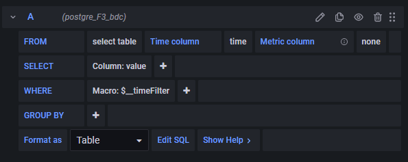

Panel options页用来设置Panel的标题，和Panel的link

再下面的部分用来设置显示的样式等

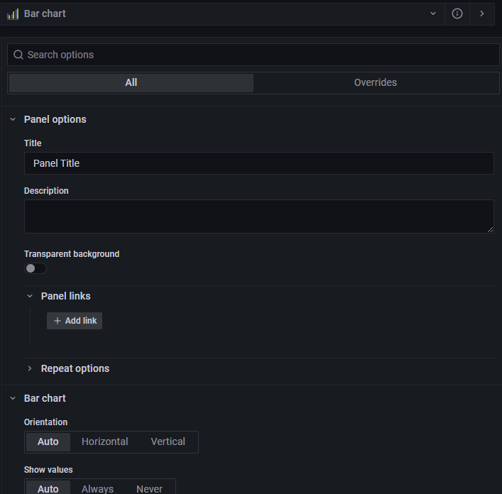

### 3. 已有控件和页面的复用

使用Grafana时经常需要复制一个已经做好的页面或控件，再对其进行修改

主要的复制方法有如下几种：

######1. 页面内的控件复制：

点击控件顶端，在菜单中选择Duplicate，在当前页面复制该控件

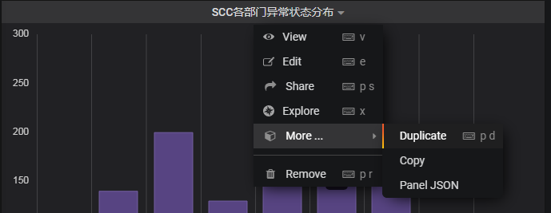

######2. 跨页面的控件复制：

如上图，在菜单中选择*Copy*；去其它页面新增控件，此时可以选择*Paste Copied Panel*进行复制

如上图，在菜单中选择*Panel JSON*，复制代码；去其它控件也打开*Panel JSON*，粘贴覆盖然后Update，也可实现复制。

当copy了某个控件后，在新增panel时就会有对应的选项出现，平时是只有其它三个选项的

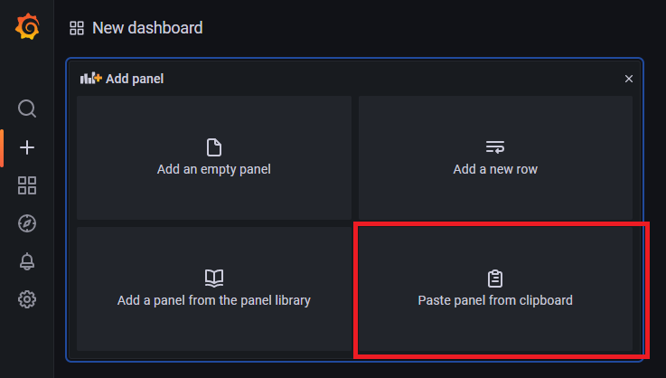

######3. 整个页面的复制：

最简单的是打开页面设置菜单通过Save As进行复制；

也可以通过JSON Model，复代码，然后到folder Manage页面，导入它。

导入时通常要修改uid。

### 4. Grafana页面的参数设置

通过顶部的菜单可以进入页面的参数设置页面

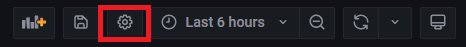

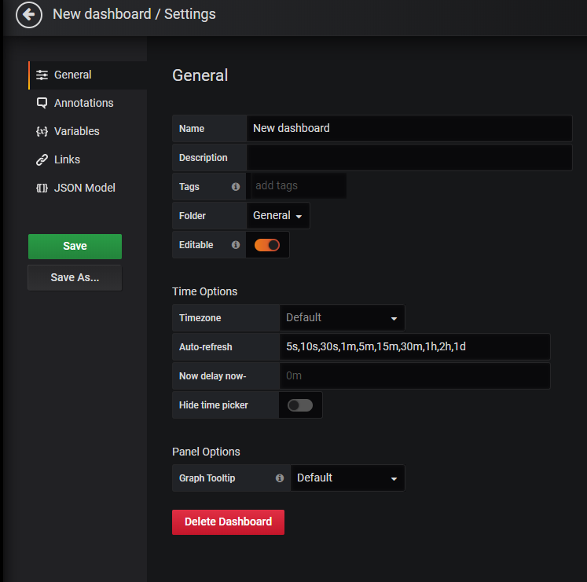

在General部分，我们可以设置页面的名称、目录、时区等内容。

- 设置页面的Name和Folder

页面的Name也会体现在它的URL中

比如例子中的name是Abnormal Process,它的URL就是http://172.25.57.1:3603/d/4uMpPQqnk/abnormal-process?orgId=2

这里面唯一标识是 4uMpPQqnk，名字只是用来帮助识别

如果URL的名字写错了，也能正确进入看板

		需要注意的是，有时我们在做页面跳转时会跳转到当前页面，这其实就是更新当前页面的URL参数；这时刷新的效果是页面内刷新，只有数据变化；但如果这时URL的名字写错了，那刷新效果就变成了浏览器刷新，和按下F5刷新效果一样。

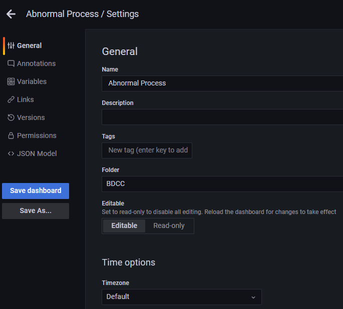

- 设置页面的时间相关属性

	- Time Options参数

可以用来设置页面使用的时区

它会影响到时间下拉框的显示和在SQL中的时间参数；

	- Auto refresh 

它其实是Auto refresh的可能值

例如我们有个页面需要2m一刷新，就可以在这个字串中增加 2m,还是用逗号分隔，之后在页面的右上角就可以选择它

	- Hide time picker

用来屏蔽页面右上角时间范围选择框的显示

固定时间排布的页面，尽量都勾选这一项

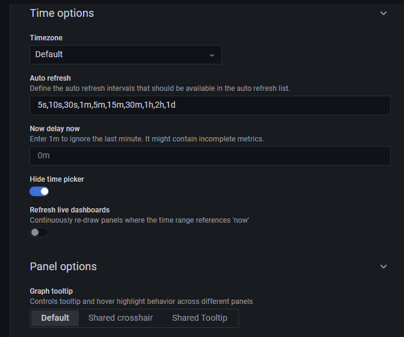

- 对页面使用变量

Grafana可以对页面使用变量，常用的类型有 Query、Custom、Constant

	- Query：

选择DataSource，在Regex那里写sql语句，查询数据库中某一字段，结果即是该参数的可选项；

可以设置参数的刷新频率，通常选择 On Time Range Changed，就可以随着看板的数据刷新同步刷新

	- Custom：

写入几个值，作为参数的可选项；

可以参考http://172.25.57.1:3603/d/0PGeYyqnk/fai-defect-rate?orgId=2 这个页面的使用；

可以看到参数变化时url的变化(var-参数名=…)

	- Constant：

不设定值，参数的值由URL传过来；

通常在某个控件上点击跳转到另一页面时使用

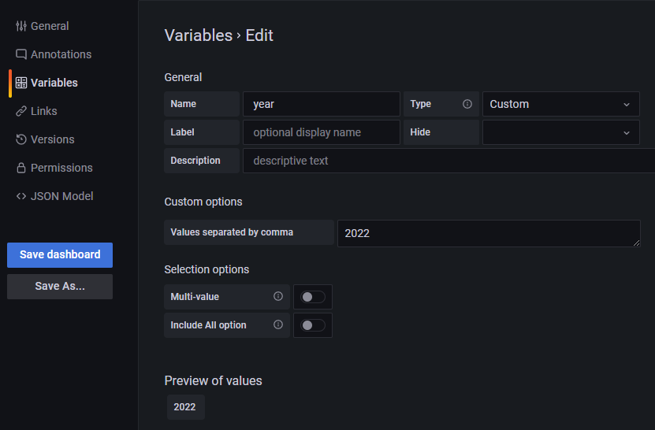

### 5.柱线图的设置详述

柱线图推荐使用 Inventec Bar-Line Chart
首先，我们从整理表中随便抓一点数据，把它放到柱图的SQL里去
> 	select * from dm.trendchart_fpy
    where pdline = 'A01' and datetype = 'W'
    order by starttime desc 
    limit 14

然后，我们先来设置X轴
从图中可以看到，所有不是数字类型的字段，都可以供选择
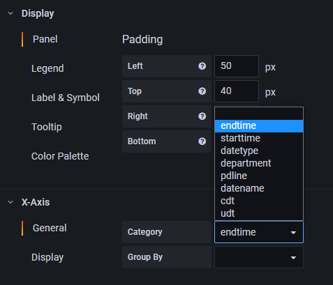
但是我们并不推荐使用时间类型（timestamp或date类型)的字段，Grafana会按自己的逻辑把时间拆开，往往不是你想要的结果。
如果需要使用时间做X轴，建议用to_char()另做一个字段。

接下来，到Data Series这里，选择要展示的数字。这里和X轴相反，只能选择数字类型的字段。
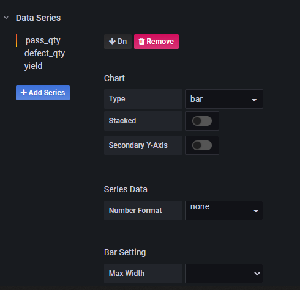
当有多组字段时，默认柱图是并排的，要想做成叠加柱图，要选择Stacked；
所有需要叠加的字段，都要选Stacked；
用来做线图的字段要移到最上面，这样它会显示在最前，否则会被挡住；
当柱线并存时，对线图的字段要选择 Secondary Y-Axis;
Series Data是很多控件通用的设置，用来设置数值的单位，百分比的显示、小数的位数也在这里设置；

数值设置之后，再来调节横轴和纵轴的显示：
横轴的显示设置在这里，需要多点一下才能出来
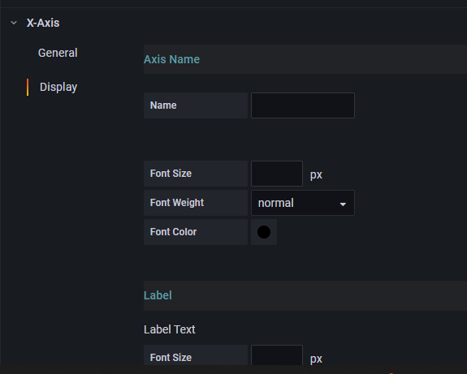
Font Size使用的是px，就是像素大小，和平时使用的字号不同；
遇到显示不开的情况，可以使用Rotate设置一个角度，把横坐标旋转一下；
横坐标旋转时需要设置成向右对齐，并且需求调节距离来适配。

Y轴的设置那里，默认是对左侧Y轴的设置；
如果前面设置了使用Secondary Y-Axis，还需要在这里再打开它，才能起作用；
左右两侧Y轴是独立设置的。
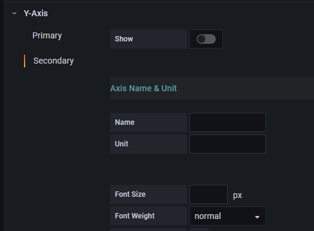
Y轴主要的设置是这一部分，
用来设置高度范围
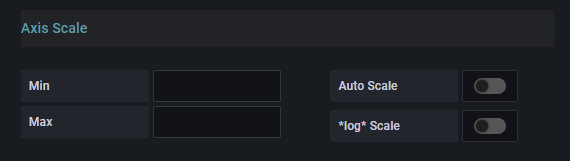
当遇到数值相差过大的时候，可以通过选择 log Scale 和 Auto Scale显示对数坐标
对数坐标效果如下图：
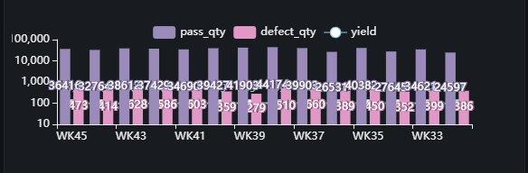

我们推荐在设置完以上设定之后，再来进行显示方面的设定：
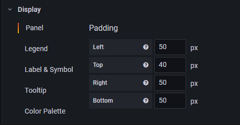
Panel这里，是调整四个边缘的宽度，目的是美观及显示完整；
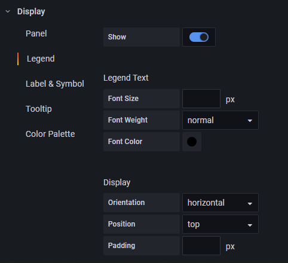
Legend这里，是图例的相关设定；
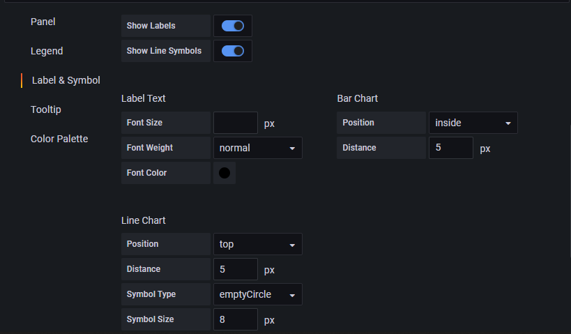
Color Palette这里设置各柱、线的颜色
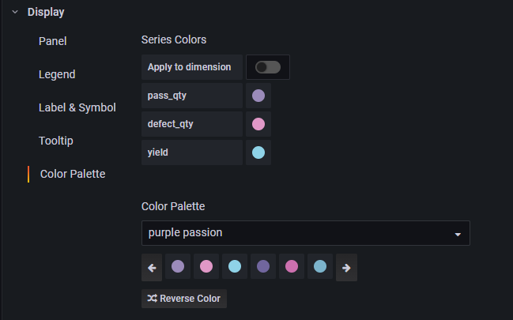
特别需要说一下X轴的Group的概念，Group是根据某一个字段的值来设置颜色
我们一般在sql里做归纳，在页面设置。

最后，针对需求增加跳转链接
要在Panel Options下面的Panel links里面添加链接
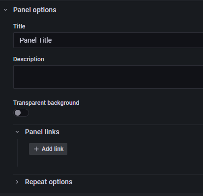
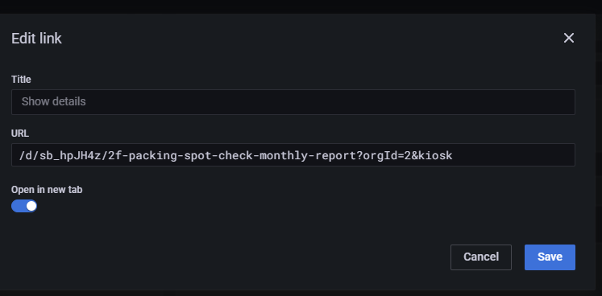
我们使用一个已经存在的页面地址，grafana自己的页面直接使用 /d 及后面的部分，这样如果将来域名有变动不需要每个链接都修改一遍。
这个被跳转的链接一般会有URL参数，如第四章所讲，URL参数是var-参数名=…
所以例子中的这个URL就会写成
>	/d/sb_hpJH4z/2f-packing-spot-check-monthly-report?orgId=2&kiosk&var-date=${name}

${name}会被替代为X轴的坐标值；
也可以使用${col:colname}来指定一个字段的值；
如前所述，我们X轴不会直接用时间，比如会用 WK40、11-12这样的varchar来做坐标，但跳转链接可能需要详细时间，或者星期和月的开始时间、带年度的日期等等，通常会再增加一个字段来记录，这时就会用到${col:colname}的方式来传递；
这个Eidt link框有一点bug,假如你写入的时候用了退格键，它就会带出一些特殊字符，导致跳转后无法匹配，所以我们建议在记事本写好了再贴过来。
之后还要在Drill Down这里选择一下刚才增加的链接，才起作用
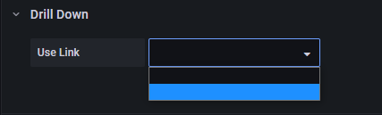

### 6.饼图的设置详述

饼图推荐使用Inventec Pie Chart
首先，我们从整理表中随便抓一点数据，把它放到饼图的SQL里去
> 	select pdline, defect_qty from dm.trendchart_fpy
	where datetype = 'W'
    and starttime = 
    	(select max(starttime) from dm.trendchart_fpy where datetype = 'W')

饼图要求有一个Category，一个Metrics，简单可以理解为name和value
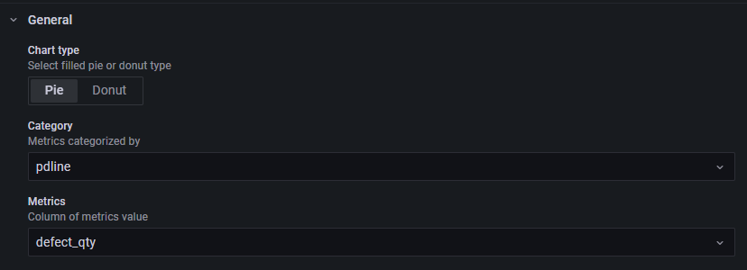
设定之后，图形就可以显示了，可以选择显示饼图或者环图
Display这里用来设定Label的字体大小和指示线的长度；
当文本略有折叠时可以通过调整指示线的长度来进行修改；
它甚至可以写入负值，这时Label会压一点饼图显示
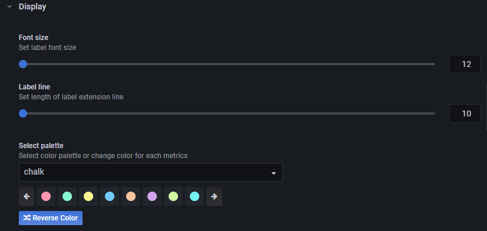

但即使这样，也有无法调整正常的情况
这时通常会使用Top N来设置只看主要的部分，剩余的部分加总为Others
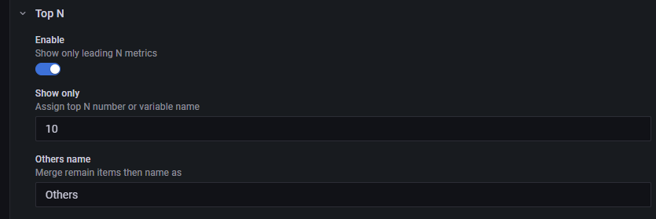

当作为环图显示时，还可以显示各项的总和
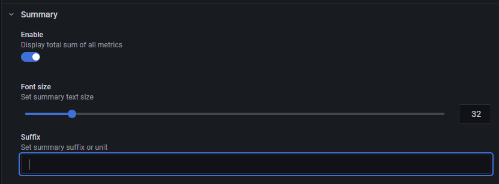

饼图也可以做超链接，它没有使用Panel Options里的链接，而是使用Data links这里来设置
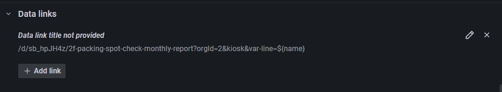

### 7.表格的设置详述

表格可以使用Grafana自有表格控件Table，也可以使用CopperHill Custom Table

#### 1.Table控件
先来看Table控件
我们使用之前柱线图的SQL
Table这个节点下面是一些显示相关的设定
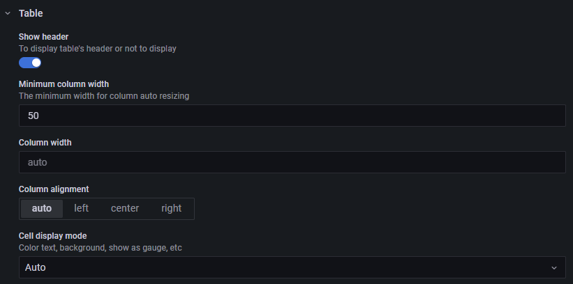
其中display mode，可以把表格设置成带进度条的模式
进度条受Standard Options里的Min、Max制约
比如下图这样设置，效果也如下：
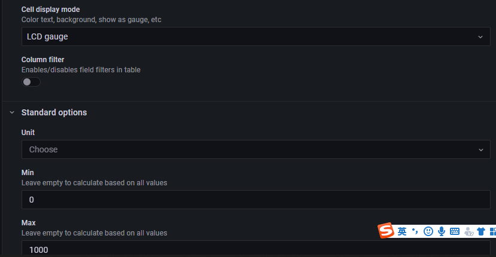
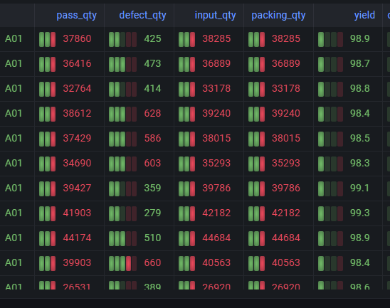
至于颜色，是受Threshold制约。
但是这样这个控件会把所有列都设成进度条，就需要对不需要的列做单独设定；
当然，也可以单独设定需要特定显示的列。
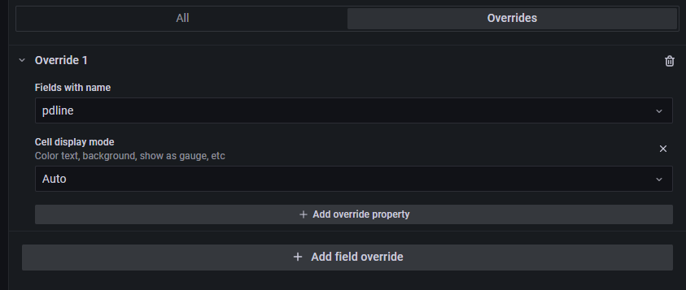
Table 控件比较不好的一点，是表头格式不能改。

#### 2.CopperHill Custom Table控件
再来看CopperHill Custom Table
首先，它有一系列针对表格整体的设定，包括排序、搜索框、分页设定、时区设定等
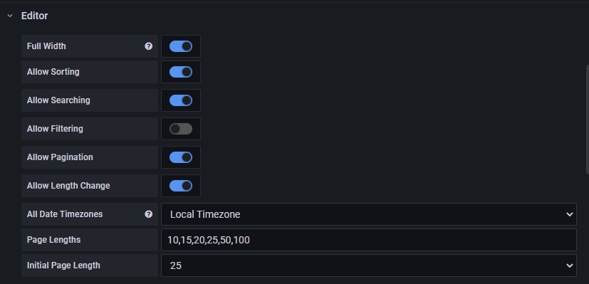
也有针对单一字段的设定
其中Filter支持正则表达式；也可以用全字段来找到对应字段；
Display这里，${value}就是SQL查出来的字段名，可以改成其它，甚至是html；
这里的Link URL指点击表头跳转的链接，一般是不这样用的；
IsVisible 如果去掉，则这一列不显示。
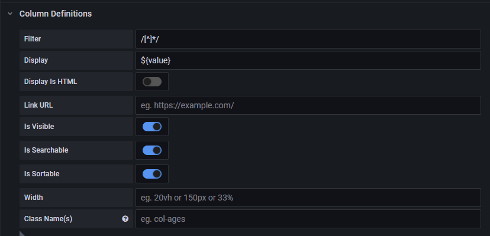

在指定列的下面，还可以针对内容再做设定
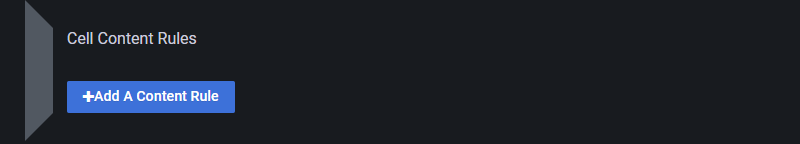
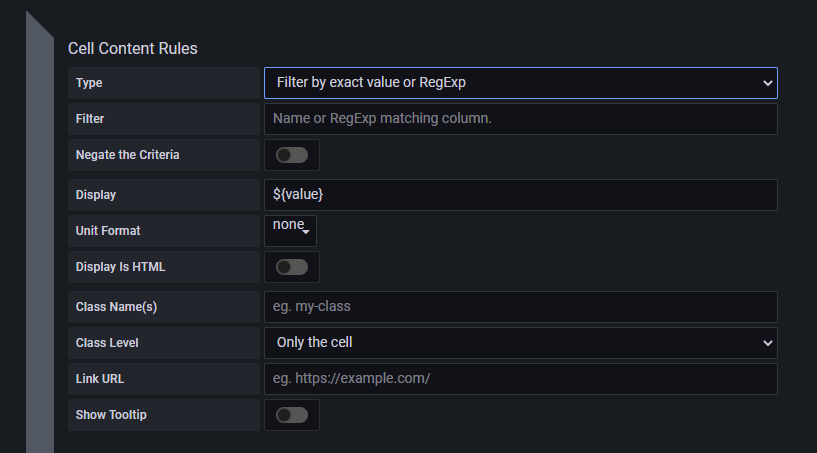
Type这里默认是Filter by exact value or RegExp，仍然是要在Filter里写入正则表达式；
可以切换成 Match a range of values
这时Lower Bound Operator可以选择 < 或 <=; Upper Bound Operator可以选择 > 或 >=
Bound Value那里则写入你要比对的值。
和我们一般理解的相反， < 是指 Bound Value < cell, cell即查询出来的表格里的值，这里需要特别注意。

Type也可以切换成 Is NULL,即用来设定表格里为空时显示什么；
更多的时候，我们是针对全部不为空的值来设定，所以通常会把 Is NULL和 Negate the Criteria连用，
Negate the Criteria是指反选。
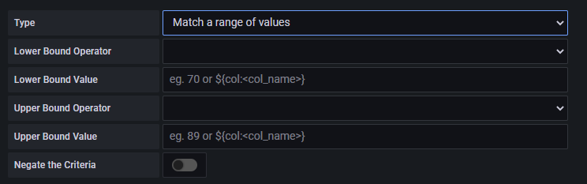

这里可以设置强制的显示内容，数字的格式、单位，也可以通过css的class指定显示的格式，还可以设定Link
但是需要的就是要稍微了解css的写法。
这个控件会把日期时间类型的字段，转换成1970年以来的毫秒数，一定要自己做一下转换才行。

#### 3.Transposed Table控件
相对于数据库查询出来的结果，我们经常会遇到需要横置显示的时候
比如查询结果是
- 月份  Value
- 一月  20
- 二月  30
- 三月  40
- 四月  50

经常会被要求显示成
- 月份	一月		二月		三月		四月
- Value	 20			30	    40	     50

这时可以选择Transposed Table控件，它的使用方法和CopperHill Custom Table基本一样，区别就是它对查询结果做了转置。