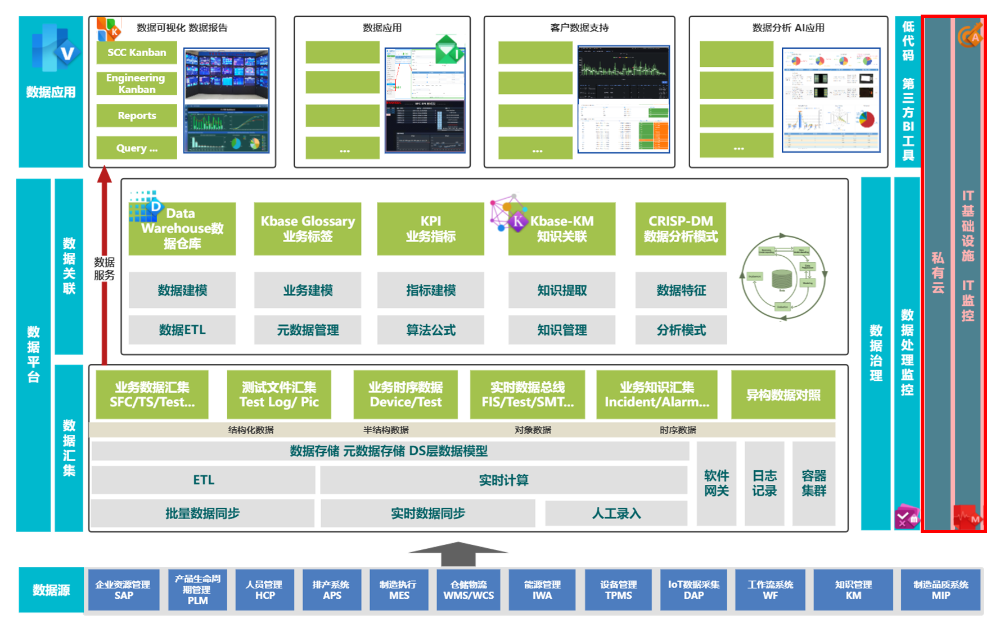

# Big Data Cloud Center Training BDCC培训课程

## 当前课程： I100 BDCC Infra 技术介绍    

### 课程版本： V1.0
### 讲师：闫硕
### 课程分类：

|课程分类|分类说明|本次课程名称|课程编码|讲师|
--------|----|-------|--------|-----
|**I 平台基础设施监控 Platform Infra Monitor**|**BDCC 基础设施和监控的相关课程**|**I100 BDCC Infra 技术介绍**|**I100**|**闫硕**|
|A 数据分析 Data Analysis |BDCC 数据分析的相关课程 | | | |
|C 数据收集 Data Collection |BDCC 数据收集的相关课程 | | | |
|D 元数据管理 Meta Data Management |BDCC 元数据管理的相关课程 | | | |
|E 数据整理 Data ETL |BDCC 数据整理ETL的相关课程 | | | |
|G 数据治理 Data Governance |BDCC 数据治理的相关课程 | | | |
|M 数据建模 Data Modeling |BDCC 数据建模的相关课程 | | | |
|P 数据应用 Data Application |BDCC 数据应用的相关课程 | | | |
|V 数据可视化 Data Visualization |BDCC 数据可视化的相关课程 | | | |

# 前言 Preface

## 课程在BDCC架构中的映射

